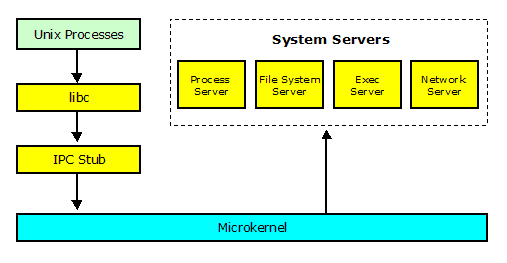
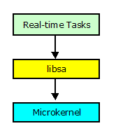

# Prex Application Programming Guide

### Table of Contents

- Introduction
- Application Overview
- Compiling Applications
- Testing Applications
- Thread Creation
- Programming Timer
- Handling Exceptions
- Device Access
- Log Service
- Panic Service


## Introduction

This document describes how to make a user application for Prex.

For a full description of the Prex application interface, see the following documents.

- [Prex Kernel API reference](kapi.md)
- [POSIX Compliance](posix.md)
- [Prex Sample Applications](sample.md)

## Application Overview

### Application Type

Prex supports the following two different types of application:

- Native Real-time Tasks
- UNIX Processes

They use different startup code, different C library and different Makefile.

The following table shows the difference between these task types.

| -                     | Real-time Task             | Unix Process               |
| --------------------- | -------------------------- | -------------------------- |
| Task Priority         | High                       | Low                        |
| Loaded by             | Kernel                     | Exec Server                |
| Loaded at             | Boot                       | Runtime                    |
| UNIX System Calls     | Not supported              | Supported                  |
| File Access           | Raw I/O                    | Buffered I/O               |
| C library             | Limited functions (libsa)  | Full functions (libc)      |
| Server Requirement    | No need any servers        | boot, fs, proc, exec       |
| Privileged Operations | Allowed                    | Limited                    |
| Media                 | Stored in boot file system | Stored in any file systems |

### Library Support

There exist two different C libraries for applications.

- libc: The standard C library can be used by Unix processes.
- libsa: The stand-alone C library  is a subset of libc, and it's available for native real-time tasks.

#### libc

Mmost POSIX services are provided by the system servers running in the user mode. So, an application must send an IPC message to the system servers to access POSIX interface. Prex's libc includes the IPC messaging stub for the POSIX service, and so, applications do not care about IPC transmission (Figure 1).

  
Figure 1. Structure of libc

Prex's libc is derived from *BSD, but it's fully optimized for low footprint system.

#### libsa

The stand-alone C library does not require any system servers. The library supports only limited POSIX functions. There are minimum stdio routines which access the I/O device directory via microkernel (Figure 2). It does not support any Unix system calls.

  
 Figure 2. Structure of libsa

## Compiling Applications

### Makefile

Native real-time tasks and POSIX applications require different Makefiles to be compiled.

#### Compiling native real-time tasks

Makefile:

```
TASK=   hello.rt
include $(SRCDIR)/mk/task.mk
```

#### Compiling POSIX applications

Makefile:

```
PROG= hello
include $(SRCDIR)/mk/prog.mk
```

### Build

Just run make tool at the target source directory.

```
$ make
```

Note: The detailed information for the Prex tool chain is described in [Prex Build Guide](http://prex.sourceforge.net/doc/build.html).

## Testing Applications

All native real-time tasks are loaded by the kernel at boot time. On the other hand, POSIX applications are loaded by the exec server at runtime. In addition, POSIX applications require system servers to be loaded.

### Installing Native Tasks

To setup a native real-time task to be loaded at boot time, it must be registered as a boot task in the configuration file named /conf/etc/tasks.mk. In order to load "hello" program at boot time, the following line will be added to the configuration file.

```
TASKS+=     $(SRCDIR)/usr/test/hello/hello.rt
```

The application is executed immediately after the kernel initialization with this setting.

### Installing POSIX Applications

POSIX applications require that the following servers are loaded in the system.

- **boot:** Boot Server
- **proc:** Process Server
- **fs:** File system Server
- **exec:** Exec Server

To load these servers at boot time, the following lines must be added in the configuration file named /conf/etc/task.mk.

```
TASKS+=     $(SRCDIR)/usr/server/boot/boot
TASKS+=     $(SRCDIR)/usr/server/proc/proc
TASKS+=     $(SRCDIR)/usr/server/exec/exec
TASKS+=     $(SRCDIR)/usr/server/fs/fs
```


A POSIX application can be stored in any file system. The following line in /conf/etc/files.mk will add the "hello" application into the boot file system.

```
FILES+=     $(SRCDIR)/usr/test/hello/hello
```

The registered files in the boot file system will appear under the directory named "/boot" on the target system. Then, the "hello" application can be executed from the shell.

```
[prex:/boot]# ls
init cmdbox hello
[prex:/boot]# hello
Hello World!
[prex:/boot]#
```

### Setting Task Capability

If the target application must require privileged operations, an appropriate task capability must be set in the security configuration file (/conf/etc/security).

## Thread Creation

### Creating a new thread

This is a sample to create and run a new thread in the same task.

```
int
thread_run(void *start, void *stack, thread_t *th)
{
        thread_t t;
        int err;

        if ((err = thread_create(task_self(), &t)) != 0)
                 return err;

        if ((err = thread_load(t, start, stack)) != 0)
                 return err;

        if ((err = thread_resume(t)) != 0)
                 return err;

        *th = t;
        return 0;
}
```

The buffer for stack must be prepared by the parent thread.

### Thread Entry Point

The entry point for a thread takes the following form.

```
void
thread_entry(void)
{
        ...
}
```

## Programming Timer

### Sleep timer

The following sample will simply stop the task for 500ms.

```
int
main()
{
        timer_sleep(500, 0);
}
```

### Periodic timer

This is a sample to show a message per 100msec starting after 5sec.

```
int
main()
{
        int count = 0;

        sys_log("periodic timer test program\n");

        /* Setup timer */
        timer_periodic(thread_self(), 5000, 100);

        while (count++ < 5) {
                timer_waitperiod();
                sys_log("Hello!\n");
        }

        /* Cancel timer */
        timer_periodic(thread_self(), 0, 0);
        return 0;
}
```

## Handling Exceptions

### Exception handler

The Prex task can provide one exception handler for each task. The exception handler must call exception_return() at the end of the handler.

```
static void
my_exception(int code)
{

        printf("Get exception code=%x\n", code);

        switch (code) {
        ...
        }
        exception_return();
}
```

### Setup exception handler

The exception handler must be registered to the kernel by using exception_setup(). If the argument of exception_setup() is NULL, the previously used  exception handler will be uninstalled.

```
int
main(int argc, char *argv[])
{

        /* Install the exception handler */
        exception_setup(my_exception);

        ...

        /* Uninstall the exception handler */
        exception_setup(NULL);

        return 0;
}
```

### Raising exception

An application can send a specific exception to the task.

```
        exception_raise(task, SIGTERM);
```

The task must have an appropriate capability to send an exception.

### Getting alarm exception

timer_alarm() send a timer exception (SIGALRM) to the caller task at the specified time interval. The following sample programs to send an alarm exception in 500msec interval.

```
        timer_alarm(500, 0);
```

## Device Access

The Prex kernel provides some raw I/O operations for devices. It includes open/close/read/write/ioctl.

The following code shows how to access the device from the application.

```
int
main(int argc, char *argv[])
{
	device_t console_dev;
	char buf[] = "ABCDEFGHIJKLMN";
	size_t len;

	/*
	 * Open device
	 */
	if ((device_open("console", 0, &console_dev) != 0)
		sys_log("device open err!\n");

	/*
	 * Display 'ABCDE'
	 */
	len = 5;
	device_write(console_dev, buf, &len, 0);

	/*
	 * Close device
	 */
	if (device_close(console_dev) != 0)
		sys_log("device close err!\n");

	return 0;
}
```

## Log Service

The Prex kernel supports the message log service for applications. The following service will display a message to the diagnostic port via the kernel.

```
int     sys_log(const char *msg);
```

Note: This service is available only when the kernel is built with a debug option.

## Panic Service

The panic service is generally used in the kernel mode to process unrecoverable errors. In case of Prex, this service is exported to the user mode applications in order to track the fatal condition caused by system tasks.

Prex provides the following kernel API.

```
void    sys_panic(const char *msg);
```

The kernel behavior for this service is different depending on its build mode.

- **Release Build:** The kernel will terminate the task which calls the sys_panic() service.
- **Debug Build:** The kernel will show the panic message and stop the entire system.

```
User mode panic: task:sleep thread:8000a7d4
test panic!
============================
Trap 3: Breakpoint
============================
Trap frame 8000ab18 error 0
 eax 0000000d ebx 80009f34 ecx 00000000 edx 0000053b esi 00000001 edi 08050754
 eip 800104ed esp 8000ab18 ebp 8000ab6c eflags 00000002
 cs  00000010 ss  80000018 ds  80000018 es  80010018 esp0 8000abb4
 >> interrupt is disabled
 >> Oops! it's kernel mode now!!!
 >> task=sleep (id:80009f34)
Stack trace:
 0804a472
 0804a3a1
 0804810c
 080480aa
```

This service may be useful for the application developer to track the error conditions.


Copyright© 2005-2009 Kohsuke Ohtani