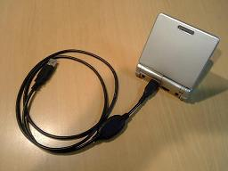
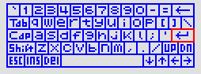

# Prex Game Boy Advance - HOWTO

### Table of Contents

**HOWTO**

- How to run Prex on the Game Boy Advance?
- How to run Prex with VisualBoy Advance?
- How to compile Prex for Game Boy Advance?
- How to use On-screen Keyboard?

**Technical Note**

- Technical Specs
- Memory Map
- System Call


## How to run Prex on the Game Boy Advance?

There exist some hardware to run Prex on the Game Boy Advance. Currently, I am using "Boot Cable USB" which is sold by [Optimize](http://optimize.ath.cx/shopv2_2/chuumon.html). And, its control software is available for download from this [page](http://optimize.ath.cx/bootcable/btusb.html). Unfortunately, these are only japanese page... :-( 
 You may find other useful information to run your program on GBA at  http://www.gbadev.org.

  
 Figure 1. Boot Cable USB

## How to run Prex with the VisualBoy Advance?

VBA - VisualBoy Advance is most popular GBA emulator. You can find the  latest release at  [http://www.vba.ngemu.com](http://vba.ngemu.com). To run Prex with VBA, simply select file->open and open the prex image. There is no need to prepare the original GBA BIOS.

**Important:** You must rename the file name of the image to "prexos.gba". It seems VBA is checking the file extension to validate the image.

The default keyboard setting of VBA is as follows:


| PC Key      | GBA Button            |
| ----------- | --------------------- |
| Cursor Keys | Up, Down, Left, Right |
| Z           | Button A              |
| X           | Button B              |
| A           | Button L              |
| S           | Button R              |
| Enter       | Start                 |
| Backspace   | Select                |

## How to compile Prex for Game Boy Advance?

At first, you have to prepare the toolchain for cross compiling ARM code. And then, the shell variables must be set for the arm-gba target.

#### Step 1. Unpack Archives

You have to download and unpack the following files.

```
$ cd /usr/src
$ tar zxvf binitils-2.15.tar.gz
$ tar zxvf gcc-core-3.4.3.tar.gz
```

#### Step 2. Build Binutils

Configure and build binutils.

```
$ mkdir binutils-2.15-arm-elf
$ cd binutils-2.15-arm-elf
$ ../binutils-2.15/configure --prefix=/usr/local/arm --target=arm-elf --disable-nls \
 --with-cpu=arm7tdmi
$ make
$ make install
```

You must set the path to this binutils.

```
$ export PATH=/usr/local/arm/bin:$PATH
$ cd /usr/src
```

#### Step 3. Build gcc

```
$ mkdir gcc-3.4.3-arm-elf
$ cd gcc-3.4.3-arm-elf
$ ../gcc-3.4.3/configure --prefix=/usr/local/arm --target=arm-elf --with-gnu-as \
 --with-gnu-ld --with-cpu=arm7tdmi --disable-nls --enable-languages=c \
 --enable-interwork
$ make LANGUAGES="c"
$ make LANGUAGES="c" install
$ cd /usr/src
```

#### Step 4. Unpack Sources

Unpack the sources and move to top level directory of the source tree.

```
$ cd /usr/src
$ tar zxvf prex-X.X.X.tar.gz
$ cd prex-X.X.X
```

#### Step 5. Configure

Setup target architecture and platform.

```
$ ./configure --target=arm-gba --cross-compile=arm-elf-
```

#### Step 6. Make

Run make.

```
$ make
```

Note: There is a cross-compiling kit for GBA named  [DevKit Advance](http://devkitadv.sourceforge.net). It may be usable for compiling Prex.

## How to use On-Screen Keyboard?

  
 Figure 2. On-Screen Keyboard

The driver for on-screen keyboard is provided to emulate a generic keyboard by using the GBA keypad. You can input any key by moving the cursor on the  on-screen keyboard. The user can show/hide the on-screen keyboard on the GBA screen by pressing select button. The key assign is different for each case.

| GBA Key | Function                   |
| ------- | -------------------------- |
| A       | Input current pointed key  |
| B       | "Enter" key                |
| Select  | Hide on-screen keyboard    |
| Start   | N/A                        |
| Right   | Move keyboard cursor right |
| Left    | Move keyboard cursor left  |
| Up      | Move keyboard cursor up    |
| Down    | Move keyboard cursor down  |
| R       | Toggle shift state         |
| L       | Toggle shift state         |


| GBA Key | Function                |
| ------- | ----------------------- |
| A       | "A" key                 |
| B       | "B" key                 |
| Select  | Show on-screen keyboard |
| Start   | "Enter" key             |
| Right   | Cursor "Right" key      |
| Left    | Cursor "Left" key       |
| Up      | Cursor "Up" key         |
| Down    | Cursor "Down" key       |
| R       | "R" key                 |
| L       | "L" key                 |

## Technical Specs

### GBA H/W Spec

| Processor        | ARM7TDMI, 16.78MHz      |
| ---------------- | ----------------------- |
| IWRAM (Internal) | 32 kB                   |
| EWRAM (External) | 256 kB                  |
| VRAM             | 96 kB                   |
| LCD              | 2" TFT 240 x 160 pixels |

### Memory map

| 00000000 - 00003FFF | BIOS - System ROM |
| ------------------- | ----------------- |
| 02000000 - 0203FFFF | EWRAM (256K)      |
| 03000000 - 03007FFF | IWRAM (32K)       |
| 04000000 - 040003FF | I/O Registers     |
| 05000000 - 050003FF | Palette RAM       |
| 06000000 - 06017fFF | VRAM              |
| 07000000 - 070003FF | Object Attributes |
|                     |                   |

### Prex VRAM Usage

| 06000000 - 06003FFF | Tile 1 - Font                         |
| ------------------- | ------------------------------------- |
| 06004000 - 06005FFF | Tile 2 - Keyboard Image (non shift)   |
| 06006000 - 06007FFF | Tile 2 - Keyboard Image (shift)       |
| 06008000 - 06008FFF | Background 3 Map (Console text)       |
| 06009000 - 06009FFF | Background 1 Map (Keyboard non-shift) |
| 0600A000 - 0600AFFF | Background 2 Map (Keyboard shift)     |
| 0600B000 - 0600FFFF | Not used                              |
| 06010000 - 0601FFFF | Cursor Data                           |

## System Call

Since the GBA BIOS does not allow to handle the SWI event by the program, we need some trick to handle the system call. The system call will be handled by the following steps.

- The application invoke the system call.
- The system call stub in the library will jump to the SWI exception vector (0x0202007C) in the kernel code.

```
#define SYSCALL0(name) \
        .global name; .align; \
name##: \
        stmfd   sp!, {r4, r5, lr}; \
        mov     r4, #SYS_##name; \
        ldr     r5, =0x202007c; \
        add     lr, pc, #2; \
        mov     pc, r5; \
        ldmfd   sp!, {r4, r5, pc};
```

- The kernel SWI handler will switch the processor mode to SVC mode.

```
ENTRY(syscall_entry)
        mov     r5, lr
        mrs     ip, cpsr
        bic     ip, ip, #PSR_MODE
        orr     ip, ip, #PSR_SVC_MODE
        msr     cpsr_c, ip
        mov     lr, r5
```

Since a program can not change the ARM processor mode during the USR mode, all applications are always executed in SYS mode in Prex arm-gba port.


Copyright© 2005-2009 Kohsuke Ohtani