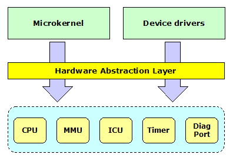

# Prex Hardware Abstraction Layer

### Table of Contents

- Introduction

- General Information
  - Data Types
  - Boot Information

- Context
  - context_set
  - context_switch
  - context_save
  - context_restore
  - context_dump

- MMU
  - mmu_map
  - mmu_newmap
  - mmu_terminate
  - mmu_switch
  - mmu_extract

- Spl
  - splhigh
  - spl0
  - splx

- Interrupt
  - interrupt_mask
  - interrupt_unmask
  - interrupt_setup
  - interrupt_init

- Clock
  - clock_init

- User Memory
  - copyin
  - copyou
  - copyinstr

- Machine
  - machine_startup
  - machine_idle
  - machine_powerdown
  - machine_abort
  - machine_bootinfo

- Diagnostic
  - diag_init
  - diag_puts


## Introduction

The interface for the architecture dependent layer is defined to abstract a processor and minimum hardware in the Prex kernel. If you want to port the Prex kernel to new architecture or new platform, you have to modify the architecture dependent codes appropriately for your target system.

  
Figure 1. HAL interface

Some functions in this interface are optional on the specific target. For example, you don't have to implement the MMU support code if your target system does not have a MMU.

It is important to minimize the number of functions in this interface. This is because the porting work will increase if it has many functions. So, the functions in this interface are limited to minimum functions required to drive the Microkernel.

## General Information

### Data Types

The following data types are defined by the architecture dependent layer.

| Data type | Description                                             |
| --------- | ------------------------------------------------------- |
| context_t | Define a processor register set for the thread context. |
| pgd_t     | Define a page directory for the MMU.                    |

### Boot Information

The kernel and device drivers can use "boot information" which includes the boot configuration and other system data. Generally, almost all data in the boot information will be prepared by the boot loader before loading a kernel. In addition, the architecture dependent layer can write data into the boot information within machine_init() routine.

 The format of the boot information:

```
struct bootinfo
{
        struct vidinfo  video;
        struct physmem  ram[NMEMS];     /* physical ram table */
        int             nr_rams;        /* number of ram blocks */
        struct physmem  bootdisk;       /* boot disk in memory */
        int             nr_tasks;       /* number of boot tasks */
        struct module   kernel;         /* kernel image */
        struct module   driver;         /* driver image */
        struct module   tasks[1];       /* boot tasks image */
};
```

## Context

A context includes processor registers and additional per-thread information. context_t represents the pointer to the context structure of each architecture/platform. The kernel treats the pointer as a context ID and it does not touch the internal data of the context structure.

```
void context_set(context_t ctx, int type, register_t val);
void context_switch(context_t prev, context_t next);
void context_save(context_t ctx);
void context_restore(context_t ctx);
void context_dump(context_t ctx);
```

- context_set()

  Sets data *val* to the specific registers in *ctx*. The *type* is one of the following register type.   CTX_KSTACK - Set the kernel mode stack address.  CTX_KENTRY - Set the kernel mode entry address.  CTX_KARG   - Set the kernel mode argument.  CTX_UENTRY - Set the user mode entry address.  CTX_USTACK - Set the user mode stack address.  CTX_UARG   - Set the user mode argument.

- context_switch()

  Switches the current context to new context pointed by *next*.

- context_save()

  Saves the current user mode context to the thread local stack. This is used to handle an exception.

- context_restore()

  Restores the saved user mode context to the specified context.

- context_dump()

  Dump context for debug.

## MMU

The architecture dependent code must provide the functions for Memory Management Unit (MMU). Even if the system does not support MMU, mmu_switch() must be defined as NULL macro.

```
int   mmu_map(pgd_t pgd, paddr_t pa, vaddr_t va, size_t size, int type);
pgd_t mmu_newmap(void);
void  mmu_terminate(pgd_t pgd);
void  mmu_switch(pgd_t pgd);
void *mmu_extract(pgd_t pgd, vaddr_t va, size_t size);
```

- mmu_map()

  Maps physical memory range *pa* into the virtual address *va*. *type* is one of the following mapping type.   PG_UNMAP - Remove mapping  PG_READ - Read only mapping  PG_WRITE - Read/write are allowed  PG_SYSTEM - System memory  PG_IOMEM - I/O memory It returns 0 on success, or -1 on failure.

- mmu_newmap()

  Creates a new map. It returns new page directory on success, or NULL on failure. This routine will be called when new task is created.

- mmu_terminate()

  Deletes all page mapping in the page directory *pgd*.

- mmu_switch()

  Switchs to new page directory specified in *pgd*. This is called when the thread is switched.

- mmu_extract()

  Returns the physical address for the specified virtual address. It returns NULL if at least one page is not mapped.

## Spl

The spl() function familly controls the interrupt priority level of CPU.

```
int  splhigh(void);
int  spl0(void);
void splx(int level);
```

- splhigh()

  Block all interrupts. Returns previous interrupt state.

- spl0()

  Unblock all interrupts. Returns previous interrupt state.

- splx()

  Restore the interrupt state.

## Interrupt

The kernel abstracts whole interrupt related hardware.  The architecture dependent interface provides only primitive routines to handle the interrupt.

```
void interrupt_mask(int vector);
void interrupt_unmask(int vector, int level);
void interrupt_setup(int vector, int mode);
void interrupt_init(void);
```

- interrupt_mask()

  Masks the interrupt for the specified interrupt *vector*.

- interrupt_unmask()

  Unmasks the interrupt for the specified interrupt *vector*. The interrupt priority level is set to *level*.

- interrupt_setup()

  Programs the interrupt mode. *mode* is one of the following value.          IMODE_EDGE - Edge trigger      IMODE_LEVEL - Level trigger    

- interrupt_init()

  Initialize interrupt controller.

## Clock

The Prex kernel requires a clock timer hardware for all systems.

```
void clock_init(void);
```

- clock_init()

  Initializes the clock timer device.

## User Memory

Since accessing to the user memory may cause a page fault,  the manipulation of the user buffer is handled by each architecture codes. The following functions should detect the page fault and return an error if it can.

```
int copyin(void *uaddr, void *kaddr, size_t len);
int copyout(void *kaddr, void *uaddr, size_t len);
int copyinstr(const char *uaddr, void *kaddr, size_t len);
```

- copyin

  Copies the data to the kernel area from the user buffer. It returns 0 on success, or EFAULT on page fault.

- copyout

  Copies the data from the kernel buffer to the user area. It returns 0 on success, or EFAULT on page fault.

- copyinstr

  Copy string from user space. It returns 0 on success, or EFAULT on page fault.

## Machine

```
void machine_startup(void);
void machine_idle(void);
void machine_powerdown(int state);
void machine_abort(void);
void machine_bootinfo(struct bootinfo **);
```

- machine_startup()

  Initialize basic h/w.

- machine_idle()

  Sets the system to the low power mode until any interrupt occurs.

- machine_powerdown()

  Set the system power state.          PWR_SUSPEND - Suspend      PWR_OFF - Power off      PWR_REBOOT - Reboot    

- machine_abort()

  Resets the system or recovers it.

- machine_bootinfo()

  Return pointer to the boot information.

## Diagnostic

```
void diag_init(void);
void diag_puts(char *str);
```

- diag_init()

  Initialize diagnostic port.

- diag_puts()

  Puts the message specified by *str* to the output device.


Copyright© 2005-2009 Kohsuke Ohtani