# Prex Kernel Internals

### Table of Contents

- Introduction
- Design Philosophies
- Kernel Overview
- Task
- Thread
- Scheduler
- Memory Management
- IPC
- Exception Handling
- Interrupt Framework
- Timer
- Device I/O Services
- Synchronous Services
- Debug
- Hardware Abstraction Layer

## Introduction

This document describes the design and implementation of the Prex kernel.

For a full description of the Prex kernel interface, see the following documents.

- [Prex Kernel API reference](kapi.md)
- [Hardware Abstraction Layer](hal.md)

The following documents may be helpful to understand the security and power management features of Prex.

- [Prex Platform Security](security.md)
- [Prex Power Management](power.md)

## Design Philosophies

The Prex kernel focuses the following points to be designed.

#### Portability

Portability is the most important point for the kernel design in Prex. The Prex kernel is divided into two different layers - a common kernel layer and a hardware abstraction layer (HAL). Any routine in the common kernel layer must not access to the H/W by itself. Instead, it must use the H/W access services provided by HAL.

#### Scalability

In order to obtain higher scalability, the kernel does not limit the maximum number of the kernel objects to create. So, the resources for all kernel objects are allocated dynamically after system boot. This can keep the memory prerequisite smaller than the static resource allocation. This means that the kernel can create any numbers of threads, objects, devices, events, mutexes and timers as far as usable memory remains.

The kernel supports both of MMU and MMU-less systems. So, most components of the kernel are designed carefully to work without MMU.

#### Reliability

When the remaining memory is exhausted, what should OS do? If the system can stop with panic() there, we can prevent many error checks in the kernel. But obviously, this is not allowed on the reliable system. Even if the memory is exhausted, a kernel must continue to do its jobs. So, all kernel codes are always checking the error status returned by the memory allocation routine.

In addition, the kernel must not crush anytime even if any invalid parameter is passed via kernel API. Basically, the Prex kernel code is written with "garbage in, error out" principle. The Prex kernel never stops even if any malicious program is loaded.

#### Interoperability

Although the Prex kernel was written from scratch, its applications will be brought from the other operating systems like BSD. So, the system call interface is designed with consideration to support generic OS API like POSIX or APIs for generic RTOS.

The error code for the Prex system call is defined as the same name with POSIX. For example, EINVAL for "Invalid argument", or ENOMEM for "Out of memory". So, peoples do not have to study new error codes if they already have skills about POSIX programming. This is important point to write applications and to read the kernel code because study of a new error scheme will cause pain for developers. In addition, it simplifies the POSIX emulation library because it does not have to remap the error code.

#### Maintainability

All kernel codes are kept clean and simple for the maintenance. All codes are well-commented and consistent. It is easy to add or remove new system call into the kernel. The kernel has the debugging facility like the diagnostic message or the dump of the kernel objects.

## Kernel Overview

### Kernel Structure

The following figure illustrates the Prex kernel components.

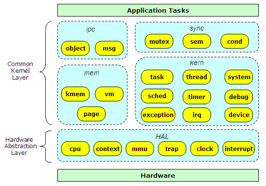  
Figure 1. Prex Kernel Components

Each kernel object belongs in one of the following groups.

- **kern**: kernel core components
- **mem**: memory managers
- **ipc**: inter process communication
- **sync**: synchronize objects
- **hal**: hardware abstraction layer

These group name are mapped to the directory name of the source tree. The following figure shows the kernel directory structure of Prex.

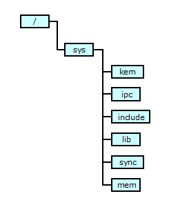  
Figure 2. Kernel Directory Structure

### Naming Convention

The name of "group/object" in figure 1 is mapped to "directory/file" in the Prex source tree. For example, the thread related functions are located in "kern/thread.c", and the functions for semaphore are placed in "sync/sem.c".

```
/kern/debug.c
/kern/device.c
/kern/exception.c
/kern/irq.c
/kern/sched.c
/kern/system.c
/kern/task.c
/kern/thread.c
/kern/timer.c
/mem/kmem.c
...
```

In addition, there is a standard naming convention about kernel routines. The method named *bar* for the object named *foo* should be named "foo_bar". For example, the routine to create a new thread is named "thread_create", and locking mutex will be "mutex_lock". This rule is not applied to the name for the local (private) functions in a file.

### Features

The Prex microkernel provides the following kernel services:

- threads and tasks
- message passing (IPC)
- timers
- exceptions
- device I/O
- mutexes
- semaphores
- condition variables
- debug and log service

## Task

### Major Concepts

Prex tasks contain the capabilities, IPC objects, synchronize objects, and address space of a running entity. Tasks perform no computation; they are a framework for running threads.

The following figure illustrates contents of the task.

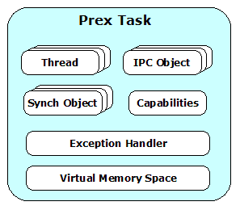  
Figure 3. Prex Task

Table 1 shows kernel interfaces for task operation.

| Function         | Description                                 |
| ---------------- | ------------------------------------------- |
| task_create()    | Create a new task                           |
| task_terminate() | Terminate a task                            |
| task_self()      | Return current task ID                      |
| task_suspend()   | Increment the task suspend count            |
| task_resume()    | Decrement task the task suspend count       |
| task_setname()   | Set task name                               |
| task_setcap()    | Set task capabilities                       |
| task_chkcap()    | Check if the task has a specific capability |

### Task Creation

The task can be created by using task_create(). New child task will have the same memory image with the parent task. Especially text region and read-only region are physically shared among them. The parent task receives the new task ID of child task from task_create(), but child task will receive 0 as task ID.

The initial task states of a created task are as follows:

| Data Type         | Initial state               | Inherit from parent task? |
| ----------------- | --------------------------- | ------------------------- |
| IPC Objects       | No IPC object               | No                        |
| Threads           | No thread                   | No                        |
| Memory Space      | Selectable (New/Share/Copy) | Selectable                |
| Suspend Count     | 1                           | No                        |
| Exception Handler | Point to parent's handler   | Yes                       |
| Capabilities      | Inherited from parent       | Yes                       |
| Task Name         | "*noname"                   | No                        |

If the parent task is specified as NULL for task_create(), all child state are initialized to default. This is used in exec() emulation.

### Task Name

A kernel maintains name of each task for user mode applications such like 'ps' command. The task naming service (task_setname()) is provided as separated service from task_create() because the task name can be changed at any time by exec().

### Task Suspension

All threads in the task are stopped while the task is suspended. When the task is set to suspend state, the thread suspend count of all threads in the task is also incremented. A thread can start to run only when both of the thread suspend count and the task suspend count becomes 0.

### Kernel Task

A kernel task is the special task that has only an idle thread and the interrupt threads. It does not have any user mode memory. There exists only one kernel task which is created at boot time.

### Task Capabilities

Prex supports a security framework named "task capability". Each task will be assigned its own capabilities for various operations. When a task tries to do a privileged operation, the kernel, device drivers and system servers will check the appropriate bit in the task capability. For example, the task must have CAP_KILL capability to send an exception to another task. Or, CAP_NICE is required to adjust the scheduling parameter of the thread in another task.

## Thread

### Major Cocepts

A thread is the unit of execution in the Prex system. A thread is a sequential flow of control and is characterized by a thread context corresponding to the state of the processor at any given point during the execution of the thread.

Threads contain the minimal processing state associated with a computation, e.g. a program counter, a stack pointer, and a set of registers. A thread exists within exactly one task; however, one task may contain many threads. The following figure illustrates the Prex thread.

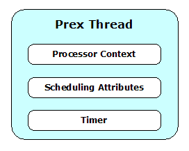  
Figure 4. Prex Thread

Table 3 shows kernel interfaces for thread operation.

| Function            | Description                               |
| ------------------- | ----------------------------------------- |
| thread_create()     | Create a new thread                       |
| thread_terminate()  | Terminate a thread                        |
| thread_load()       | Load specific thread context              |
| thread_self()       | Return current thread ID                  |
| thread_yield()      | Release a current thread for other thread |
| thread_suspend()    | Increment the task suspend count          |
| thread_resume()     | Decrement the task suspend count          |
| thread_schedparam() | Change scheduling parameter               |

### Thread Priority

Each thread is assigned the priority between 0 and 255. The lower number means higher priority like BSD UNIX. It maintains 256 level run queues mapped to each priority. The lowest priority (=255) is used only for an idle thread.

A thread has two different types of priority:

- **Base priority:**  This is a static priority which can be changed only by user mode program.  
- **Current Priority:**  An actual scheduling priority.  A kernel may adjust this priority dynamically if it's needed.

Although the base priority and the current priority are same value in most conditions, kernel will sometimes change the current priority to avoid "priority inversion".

The following table shows the priority class for various thread types.

| Class     | Priority  | Description          |
| --------- | --------- | -------------------- |
| Critical  | 0 - 14    | High priority tasks  |
| Timer     | 15        | Timer thread         |
| IST       | 16 - 32   | Interrupt threads    |
| DPC       | 33        | DPC thread           |
| Real-time | 34 - 127  | Real-time Tasks      |
| Normal    | 128 - 254 | Normal (POSIX) tasks |
| Idle      | 255       | Idle thread          |

### Thread State

Each thread has one of the following states.

- **RUN**     :Running or ready to run
- **SLEEP**   :Sleep for some event
- **SUSPEND** :Suspend count is not 0
- **EXIT**    :Terminated

The following diagram shows the state transition of a thread.

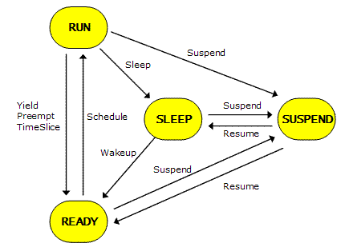  
Figure 5. Thread States

### Thread Control Block

The thread control block includes data for owner task, scheduler, timer, IPC, exception, mutex, and context. The following thread structure is most important definition in the kernel codes.

```
struct thread {
        struct list     link;           /* linkage on all threads */
        struct list     task_link;      /* linkage on thread list in task */
        struct queue    sched_link;     /* linkage on scheduling queue */
        task_t          task;           /* task to which I belong */
        int             state;          /* thread state */
        int             policy;         /* scheduling policy */
        int             priority;       /* current priority */
        int             basepri;        /* statical base priority */
        int             timeleft;       /* remaining ticks to run */
        u_int           time;           /* total running time */
        int             resched;        /* true if rescheduling is needed */
        int             locks;          /* schedule lock counter */
        int             suscnt;         /* suspend count */
        struct event    *slpevt;        /* event we are waiting on */
        int             slpret;         /* return value for sched_tleep */
        struct timer    timeout;        /* thread timer */
        struct timer    *periodic;      /* pointer to periodic timer */
        uint32_t        excbits;        /* bitmap of pending exceptions */
        struct list     mutexes;        /* mutexes locked by this thread */
        mutex_t         mutex_waiting;  /* mutex pointer currently waiting */
        struct queue    ipc_link;       /* linkage on IPC queue */
        void            *msgaddr;       /* kernel address of IPC message */
        size_t          msgsize;        /* size of IPC message */
        thread_t        sender;         /* thread that sends IPC message */
        thread_t        receiver;       /* thread that receives IPC message */
        object_t        sendobj;        /* IPC object sending to */
        object_t        recvobj;        /* IPC object receiving from */
        void            *kstack;        /* base address of kernel stack */
        struct context  ctx;            /* machine specific context */
};
```

### Thread Creation

A thread can be created by thread_create(). The initial states of newly created thread are as follows:

| Data type           | Initial state              |
| ------------------- | -------------------------- |
| Owner Task          | Inherit from parent thread |
| Thread state        | Suspended                  |
| Suspend count       | Task suspend count + 1     |
| Scheduling policy   | Round Robin                |
| Scheduling Priority | Default (= 200)            |
| Time quantum        | Default (= 50 msec)        |
| Processor registers | Default value              |

Since new thread is initially set to the suspended state, thread_resume() must be called to start it.

Creating a thread and loading its register state are isolated in different routines. These two routines are used by fork(), exec(), and pthread_create() in the POSIX emulation library.

| Library routine  | thread_create() | thread_load() |
| ---------------- | --------------- | ------------- |
| fork()           | O               | X             |
| exec()           | X               | O             |
| pthread_create() | O               | O             |

The address for the stack pointer is also set by thread_load(). Since the Prex kernel does not allocate any stack buffer for user mode threads, the parent thread has responsible to allocate it.

### Thread Termination

The kernel will usually release all resources owned by the terminated thread. But, there are some complicated processes to release the resources. For example, the priority adjustment may be required if the thread inherits its priority.

If the thread is terminated with mutex locked, all threads waiting for that mutex will sleep forever. So, the mutex held by the terminated thread must be unlocked, or change its mutex owner if some thread is waiting for.

In general, there is a known issue about the thread termination. If the termination target is the current thread, the kernel can not release the context of the current thread because the thread switching always requires current context. There are the following 3 solutions for this.

1. Create "clean up thread" to terminate a thread
2. Add condition check in thread switching code
3. Defer termination until next termination request

The Prex kernel is using #3.

### Thread Suspension

Each thread can be set to the suspended state by using thread_suspend(). Although a thread can be suspended any number of times, it does not start to run unless it is resumed by the same number of suspend.

### Kernel Thread

A kernel thread is always executed in kernel mode, and it does not have user mode context. The scheduling policy is set to SCHED_FIFO by default.

Currently, the following kernel threads are running in kernel mode.

- Interrupt Service Threads
- Timer Thread
- Idle Thread
- DPC Thread

Table 7 shows kernel interfaces to handle kernel threads.

| Function            | Description                |
| ------------------- | -------------------------- |
| kthread_create()    | Create a new kernel thread |
| kthread_terminate() | Terminate a kernel thread  |

A kernel thread will be created by calling kthread_create() function. Since we disable an interrupt during thread switching, the interrupt is still disabled at the entry of the kernel thread.  So, the kernel thread must enable interrupts by itself immediately after it gets control.

The entry point for a kernel thread takes the form:

```
static void
xxx_thread(void *arg)
{
        splhigh();      /* Enable interrupts */
        ...
}
```

### Idle Thread

An idle thread runs when no other thread is active. It has the role of cutting down the power consumption of a system. An idle thread has FIFO scheduling policy, and it does not have time quantum. The lowest scheduling priority (=255) is reserved for an idle thread.

An idle thread is just a forever-loop to call the machine dependent routine to cut power. The following thread_idle() routine is called at the end of the kernel initialization.

```
void
thread_idle(void)
{
        for (;;) {
                machine_idle();
                sched_yield();
        }
}
```

The machine_idle() routine will program the platform H/W to the low power mode. This is typically invoking the power saving (halt) instruction supported by the processor. If any interrupts are occurred in this low power mode, it must be returned immediately from machine_idle(). Then, the idle thread will call sched_yield() to check the re-scheduling.

## Scheduler

### Scheduling Queue

The Prex scheduler is based on the algorithm known as priority based multi level queue. The following diagram shows each thread is linked to the run queue for its priority.

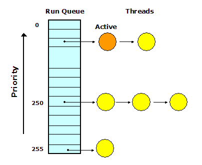  
Figure 6. Run Queue

### Scheduling Policy

There are following three types of scheduling policy.

- **SCHED_FIFO**: First-in First-out  
- **SCHED_RR**: Round Robin (SCHED_FIFO + timeslice)  
- **SCHED_OTHER**: Not supported

In early Prex development phase, SCHED_OTHER was implemented as a traditional BSD scheduler. Since this scheduler changes the thread priority dynamically, it is unpredictable and does not fit the real-time system. Recently, SCHED_OTHER policy was dropped from Prex to focus on real-time platform.

There are following 4 events to switch thread:

| Event                  | Condition                               | Run queue position       |
| ---------------------- | --------------------------------------- | ------------------------ |
| **Block**              | Thread sleep or suspend                 | Move to the tail of runq |
| **Preemption**         | Higher priority thread becomes runnable | Keep the head of runq    |
| **Quantum Expiration** | The thread consumes its time quantum    | Move to the tail of runq |
| **Yield**              | The thread releases CPU by itself       | Move to the tail of runq |

A thread is always preemptive even in kernel mode.

### Scheduling Parameters

An application program can change the following scheduling parameters via kernel API.

- Thread Priority
- Scheduling Policy

### Scheduling Lock

Thread scheduling can be disabled by locking the scheduler. This is used to synchronize thread execution to protect accessing to the global resources. Since an interrupt handler can run while scheduling lock state, it does not affect to the interrupt latency.

The scheduling lock can be performed by sched_lock()/sched_unlock() kernel functions.

### Kernel Event

The kernel event consists of the queue of the sleeping threads.

```
struct event {
        struct queue    sleepq;         /* queue for waiting thread */
        char            *name;          /* pointer to event name string */
};
```

The kernel event must be initialized by event_init() before using it.

```
static struct event     timer_event;    /* event to wakeup a timer thread */

void
timer_init(void)
{
        event_init(&timer_event, "timer");
        ...
}
```

Since each event has its own name, it is easy to know which event the thread is waiting for. The ps command can show this event name as WCHAN (wait channel).

```
[prex:/]# ps -l
  PID  PPID PRI STAT POL      TIME WCHAN       CMD
    0     0 125 R    RR          9 ipc         proc
    3     0 127 R    RR         14 ipc         exec
    2     0 126 R    RR         47 ipc         fs
    2     0 126 R    RR         72 ipc         fs
    2     0 126 R    RR         32 ipc         fs
    2     0 126 R    RR         37 ipc         fs
    1     0 253 R    RR          3 exception   init
    4     1 199 R    RR          7 exception   cmdbox
   10     4 200 R    RR          2 -           ps
[prex:/]#
```

### Sleep & Wakeup

If a thread must wait some events, it should enter sleep state and release CPU resource for other thread. The thread can sleep by calling the sched_tsleep() kernel function. And then, to wakeup the sleeping thread, the thread can use one of the sched_wakeup() and sched_wakeone(). These functions will insert or remove the thread from the queue in the event object.

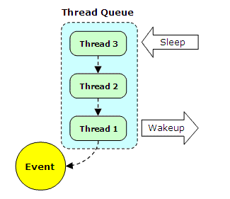  
Figure 7. Thread Queue

Table 9 shows kernel services for sleep/wakeup.

| Function        | Description                           |
| --------------- | ------------------------------------- |
| sched_tsleep()  | Sleep the current thread              |
| sched_wakeup()  | Wake up all threads sleeping on event |
| sched_wakeone() | Wake up one thread sleeping on event  |
| sched_unsleep() | Cancel sleep for the specific thread  |

Note: sched_wakeone() will select the highest priority thread among sleeping threads.

### DPC

DPC (Deferred Procedure Call) is used to call the specific function at some later time with a DPC priority. It is also known as AST or SoftIRQ in other kernels.  DPC is typically used by device drivers to do the low-priority jobs without degrading real-time performance.

The following sample shows that the kernel debugger gets a control in safer interrupt level.

```
static dpc_t    kd_dpc;                 /* dpc for debugger */

/*
 * Enter kernel debugger.
 */
void
kd_enter(void)
{

        /* Call back in DPC level */
        sched_dpc(&kd_dpc, &kd_invoke, NULL);
}
```

Each DPC routine is called by the DPC thread which works as a kernel thread. The DPC request is inserted into the DPC queue, and that request is processed by DPC thread in DPC priority at later time. All interrupts are enabled and the scheduler is unlocked when the DPC routine is called.

Since all DPC requests are maintained in single DPC queue,  request is processed in FIFO order. When the previous DPC request is still pending and its DPC object is used again, the kernel just over-ride the first request. This design allows the kernel to prevent the overflow of the DPC queue, but the device driver may need to maintain its DPC state by itself.

Prex does not support cancelling of DPC for now.

## Memory Management

### Physical Page Allocator

The physical page allocator provides the service for page allocation/deallocation/reservation. It works as a bottom layer for other memory managers.

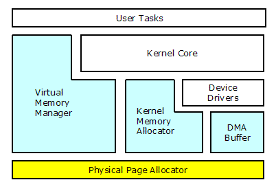  
Figure 8. Prex Memory Structure

The important point here is that the Prex kernel does not swap out any pages to the disk devices. This is a significant design policy to obtain real-time performance and system simplicity.

Table 10 shows kernel services for page allocator.

| Function       | Description                                     |
| -------------- | ----------------------------------------------- |
| page_alloc()   | Allocate continuous pages of the specified size |
| page_free()    | Free page block                                 |
| page_reserve() | Reserve pages in specific address               |

Note: The physical address returned by page_alloc() must be translated to the kernel address by pktokv() to access it.

### Kernel Memory Allocator

The kernel provides the following services for kernel memory.

| Function     | Description                                         |
| ------------ | --------------------------------------------------- |
| kmem_alloc() | Allocate memory block for kernel                    |
| kmem_free()  | Free allocated memory block                         |
| kmem_map()   | Map specified virtual address to the kernel address |

The kernel memory allocator is optimized for the small memory foot print system.

To allocate kernel memory, it is necessary to divide one page into two or more blocks. There are following 3 linked lists to manage used/free blocks for kernel memory.

1. All pages allocated for the kernel memory are linked.
2. All blocks divided in the same page are linked.
3. All free blocks of the same size are linked.

Currently, it can not handle the memory size exceeding one page. Instead, a driver can use page_alloc() to allocate large memory. 
 When the kernel code illegally writes data into non-allocated memory, the system will crash easily. The kmem modules are called from not only kernel code but from various drivers. In order to check the memory over run, each free block has a tag with magic ID.

The kernel maintains the array of the block headers for the free blocks. The index of an array is decided by the size of each block. All block has the size of the multiple of 16.

```
free_blks[0] = list for 16 byte block
free_blks[1] = list for 32 byte block
free_blks[2] = list for 48 byte block
     .
     .
free_blks[255] = list for 4096 byte block
```

In general, only one list is used to search the free block for a first fit algorithm. However, the Prex kernel memory allocator is using multiple lists corresponding to each block size. A search is started from the list of the requested size. So, it is not necessary to search smaller block's list wastefully.

In most of the "buddy" based memory allocators, their algorithm are using **2^n** bytes as block size. But, this logic will throw away much memory in case the block size is not fit. So, this is not suitable for the embedded systems that Prex aims to.

### Virtual Memory Manager

A task owns its private virtual address space. All threads in a same task share one memory space. When new task is made, the address map of the parent task will be automatically copied. In this time, the read-only space is not copied and is shared with old map.

A kernel provides the following functions for VM:

| Function       | Description                                          |
| -------------- | ---------------------------------------------------- |
| vm_allocate()  | Allocate zero-filled memory in virtual address space |
| vm_free()      | Deallocate memory segment for the specified address  |
| vm_attribute() | Change attribute of specified virtual address        |
| vm_map()       | Map another task's memory to current task            |

The VM allocator is using the traditional list-based algorithm.

The kernel task is a special task which has the virtual memory mapping for kernel. All other user mode tasks will have the same kernel memory image mapped from the kernel task. So, kernel threads can work with the all user mode task context without switching memory map.

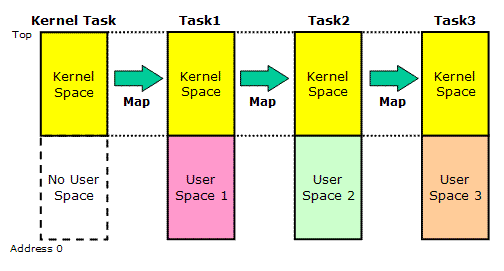  
 Figure 9. Kernel Memory Mapping

Since the Prex kernel does not do page out to an external storage, it is guaranteed that the allocated memory is always continuing and existing. Thereby, a kernel and drivers can be constructed very simply.

*Note: "Copy-on-write" feature was supported with the Prex kernel before. But, it was dropped to increase the real-time performance.*

## IPC

The message passing model of Prex is very simple compared with other modern microkernel. The Prex message is sent to the "object" from thread to thread. The "object" is similar concept that is called as "port" in other microkernel.

Since all messages in Prex are transferred among threads, the name of "IPC" is not appropriate. However, "IPC" is still used as a general term of the message transfer via the kernel, in Prex.

### Object

An object represents service, state, or policies etc. For the purpose of object manipulation, the kernel provides the following 3 basic functions:

| Function         | Description                               |
| ---------------- | ----------------------------------------- |
| object_create()  | Create a new object                       |
| object_lookup()  | Search an object in the object name space |
| object_destroy() | Destroy an existing object                |

The Prex task will create an object to publish its interface to other tasks. For example, server tasks will create objects like "!proc", "!fs", "!exec" to allow clients to access their services. And then, client tasks will send a request message to these objects.

An actual entity of the object is stored in kernel space, and it is protected from user mode code. The object data is managed with the hash table by using its name string. Usually, an object has a unique name within a system. To send a message to the specific object, the sender must obtain the ID of the target object by using object_lookup().

An object can be created without its name. These objects can be used as private objects for threads in the same task.

### Message

A message is a contiguous byte string which is logically copied from the sender 's address space to the receiver's address space.

The kernel provides the following interface for message operations.

| Function      | Description          |
| ------------- | -------------------- |
| msg_send()    | Send a message       |
| msg_receive() | Receive a message    |
| msg_reply()   | Send a reply message |

Each IPC message must include the message header in it. The kernel will automatically store the sender task's ID into the message header. This mechanism ensures the receiver task can get the exact task ID of the sender task. Therefore, receiver task can check the sender task's capability for various secure services.

```
struct msg_header {
        task_t  task;           /* id of send task */
        int     code;           /* message code */
        int     status;         /* return status */
};
```

It is necessary to recognize the pre-defined message format between sender and receiver.

Messages are sent to the specific object using msg_send(). The transmission of a message is always synchronous. This means that the thread which sent the message is blocked until it receives a response from another thread. msg_receive() performs reception of a message. msg_receive() is also blocked when no message is reached to the target object. The receiver thread must answer the message using msg_reply() after it finishes processing.

The receiver thread can not receive another message until it replies to the sender. In short, a thread can receive only one message at once. Once the thread receives message, it can send another message to different object. This mechanism allows threads to redirect the sender's request to another thread.

A thread can receive a message from the specific object which is created by itself or thread in same task. If the message has not arrived, it blocks until any message comes in. The following figure shows the IPC transmit sequence of Prex.

  
 Figure 10. IPC Transmit Sequence

### Message Transfer

The message is copied to task to task directly without kernel buffering. The memory region of sent message is automatically mapped to the receiver's memory within kernel. This mechanism allows to reduce the number of copy time while message transfer. Since there is no page out of memory in Prex, we can copy the message data via physical memory at anytime.

  
 Figure 11. IPC message transfer

## Exception Handling

A user mode task can specify its own exception handler with exception_setup(). There are two different types of exception.

- **H/W exception**:  This type of exception is caused by H/W trap & fault. The exception  will be sent to the thread which caused the trap.  If no exception handler is specified by the task, it will be  terminated by kernel.
- **S/W exception**:  The user mode task can send S/W exception to another task by exception_raise().  The exception  will be sent to the thread that is sleeping with exception_wait().  If no thread is waiting for the exception, the exception is sent  to the first thread in the target task.

Kernel supports 32 types of exception. The following pre-defined exceptions are raised by kernel itself.

| Exception | Type | Reason                |
| --------- | ---- | --------------------- |
| SIGILL    | H/W  | Illegal instruction   |
| SIGTRAP   | H/W  | Break point           |
| SIGFPE    | H/W  | Math error            |
| SIGSEGV   | H/W  | Invalid memory access |
| SIGALRM   | S/W  | Alarm event           |

POSIX emulation library will setup its own exception handler to convert the Prex exceptions into UNIX signals. It will maintain its own signal mask. And, it transfer control to the actual POSIX signal handler that is defined by the user mode process.

##  Interrupt Framework

Prex defines two different types of interrupt service to optimize the response time of real-time operation.

### Interrupt Service Routine (ISR)

ISR is started by an actual hardware interrupt. The associated interrupt is disabled in ICU and CPU interrupt is enabled while it runs. If ISR determines that its device generates the interrupt, ISR must program the device to stop the interrupt. Then, ISR should do minimum I/O operation and return control as quickly as possible. ISR will run within the context of current running thread at interrupt time. So, only few kernel services are available within ISR. ASSERT() macro can be used to detect the invalid function call from ISR.

### Interrupt Service Thread (IST)

IST is automatically activated if ISR returns INT_CONTINUE to kernel. It will be called when the system enters safer condition than ISR. Any interrupt driven I/O operation should be done in IST not ISR. Since ISR for same IRQ may be run during IST, the shared data, resources, and device registers must be synchronized by disabling interrupt. IST does not have to be reentrant, since it is not interrupted by same IST itself.

### Interrupt Nesting & Priority

Each ISR has its logical priority level, with 0 being the lowest priority. While one ISR is running, all lower priority interrupts are masked off. This interrupt nesting mechanism avoids delaying of high priority interrupt events.

IST is executed as a normal thread dispatched by the scheduler. So, the interrupt thread which has higher priority is executed first. The driver writer can specify the thread priority of IST when IST is attached to the specific interrupt line. The important point is that even a user mode task can be performed prior to an interrupt thread.

The following figure is the sample of the Prex interrupt processing.

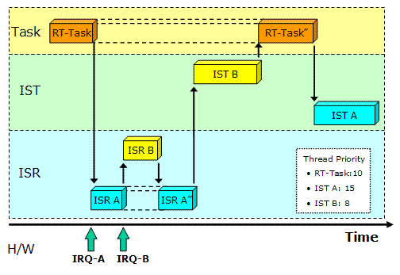  
 Figure 12. Prex Interrupt Processing

### Disabling Interrupts

splxxx() services are used to disable interrupts in order to synchronize the access to the kernel or H/W resource. splhigh() will raise the current interrupt level to the highest level and disable all interrupts. In other hand, spl0() will enable all interrupts. The caller must save the previous interrupt state and restore it with splx() as following sample.

```
int s = splhigh();              /* Raise ipl, and save previous one */
modify disk buffer cache
splx(s);                        /* Restore previous ipl */
```

### Interrupt Stack

If each ISR uses the kernel stack of the current running thread, the stack area may be over-flow when continuous interrupts are occurred at one same thread. So the kernel stack will be switched to the dedicated stack while ISR is running.

## Timer

The kernel provides the following timer features.

| Function        | Description                                                  |
| --------------- | ------------------------------------------------------------ |
| timer_sleep()   | Put caller thread to sleep in the specified time.            |
| timer_callout() | Call the routine after specified time passes.                |
| timer_alarm()   | Send SIGALRM exception to the caller task when specified delay time is passed. |
| timer_stop()    | Stop an active timer.                                        |

### Timer Structure

The timer structure must be defined to use the kernel callout timer.

```
struct timer {
        struct list     link;           /* linkage on timer chain */
        int             state;          /* timer state */
        u_long          expire;         /* expiration time, in ticks */
        u_long          interval;       /* time interval */
        void            (*func)(void *); /* function to call */
        void            *arg;           /* function argument */
        struct event    event;          /* event for this timer */
};
```

### Periodic Timer

The thread can become a periodic thread by calling timer_periodic() kernel API. The periodic thread can wait for the timer period by calling timer_waitperiod().

| Function           | Description                                  |
| ------------------ | -------------------------------------------- |
| timer_periodic()   | Set periodic timer for the specified thread. |
| timer_waitperiod() | wait next period of the periodic timer.      |

### Timer Thread

If the callout routines are called from the clock interrupt handler, it will degrade real-time performance of the system because the interrupt priority for clock is very high. So, all callout routines in Prex are called by a timer thread  which runs at timer priority level.

Each active timer is inserted to the kernel timer list. The timer list is sorted by expiration time. The timer thread is sleeping at most time. If a clock interrupt occurs, the timer interrupt handler will check the timer list and process the expired timer to be called by the timer thread later.

### Timer Jitter

The periodic timer is designed to minimize the deviation between desired and actual expiration.

## Device I/O Services

The Prex device driver module is separated from the kernel, and this module is linked with the kernel at the boot time. The kernel provides only simple and minimum services to help the  communication between applications and drivers.

### Device Object

Since the Prex kernel does not have the file system in it, the kernel provides a device object service for I/O interface. The device object is created by the device driver to communicate to the application. Usually, the driver creates a device object for an existing physical device. But, it can be used to handle logical or virtual devices. A kernel provides the following device object services for device drivers.

| Function           | Description                                    |
| ------------------ | ---------------------------------------------- |
| device_create()    | Create an device object                        |
| device_destroy()   | Destroy existing device object                 |
| device_lookup()    | Lookup specific device object                  |
| device_control()   | Send devctl command to the device object       |
| device_broadcast() | Broadcast devctl command to all device objects |
| device_private()   | Get the private data of the device object      |

The following figure illustrates the Prex device I/O operations.

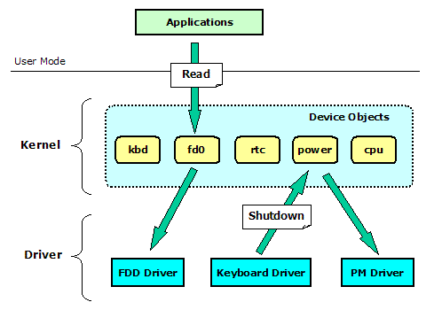  
Figure 13. Device I/O Operations

### Driver Interface

The interface between kernel and drivers are defined clearly as "Driver Kernel Interface". The kernel provides the following services for device drivers.

- Device object service
- Kernel memory allocation
- Physical page allocation
- Interrupt handling service
- Scheduler service
- Timer service
- Debug service

### Application I/O Interface

The kernel device I/O interfaces are provided to access the specific device object which is handled by a driver.  The Prex kernel provides the following 5 functions for applications.

| Function       | Description        |
| -------------- | ------------------ |
| device_open()  | Open a device      |
| device_close() | Close a device     |
| device_read()  | Read from a device |
| device_write() | Write to a device  |
| device_ioctl() | Device I/O control |

## Synchronous Service

The Prex kernel provides three different synchronization primitives:

- Mutex
- Condition Variable
- Semaphore

### Priority Inheritance for Mutex

The thread priority is automatically changed at one of the following conditions.

1.   When the current thread fails to lock the mutex and the mutex  owner has lower priority than current thread, the priority  of mutex owner is boosted to the current priority.  If this mutex owner is waiting for another mutex, such related  mutexes are also processed.  
2.   When the current thread unlocks the mutex and its priority  has already been boosted, kernel recomputes the current priority.  In this case, the priority is set to the highest  priority among the threads waiting for the mutexes locked by the  current thread.  
3.    When the priority is changed by the user request, the related (inherited)   thread's priority is also changed.  

There are following limitations about priority inheritance with Prex mutex.

1.   If the priority is changed by the user request, the priority  recomputation is done only when the new priority is higher  than old priority. The inherited priority is reset to base  priority when the mutex is unlocked.  
2.   Even if thread is killed with mutex waiting, the related  priority is not adjusted.  

## Debug

There are following debugging support functions:

- printf(): Display the debug message in kernel.
- panic(): Dump processor registers and stop system.
- ASSERT(): If expression is false (zero), stop system and display information.

The output routine for printf() is initially set to the function in HAL. However, the device driver can override this routine by using debug_attach() service.

## Hardware Abstraction Layer

The interface to the hardware abstraction layer is strictly defined by the Prex kernel. This interface is designed carefully to support various different architectures with minimum code changes. So, it is easy to port the Prex kernel to different architecture.

The following table shows the HAL class and its methods.

Table 20. HAL Interface

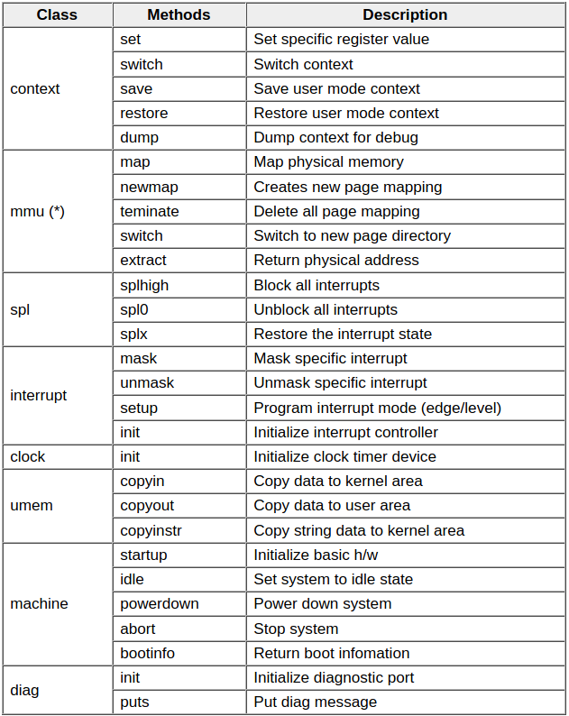  
**) In case of no-MMU system, MMU related routines will be defined as no-operation routine.*


Copyright© 2005-2009 Kohsuke Ohtani
