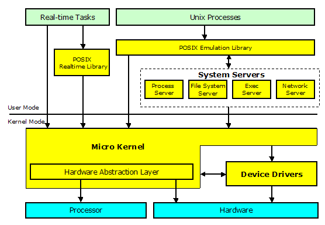
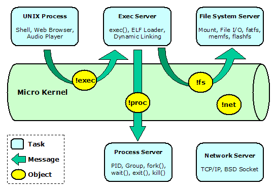
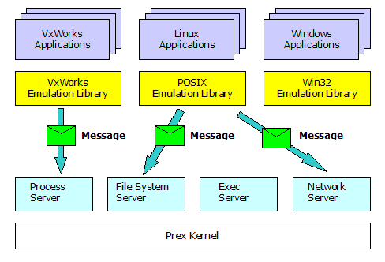
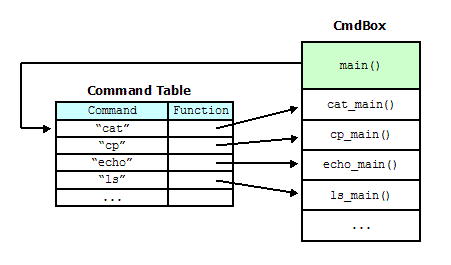

## Prex Components

The following figure illustrates the Prex components.

  
Figure 1. Prex Components

The Prex microkernel provides only fundamental functions to abstract a processor and minimum hardware. In addition, it provides some real-time support functions for real-time tasks. The microkernel also provides kernel primitive services for device drivers. There exists a thin and well-defined interface layer called as "Hardware Abstraction Layer" within a microkernel.

The other basic OS functions like process, file system, networking etc., are provided by system server tasks. There is no characteristic difference between server tasks and normal tasks. The tasks will communicate with other task by using IPC message via a microkernel.

Prex provides POSIX emulation libraries for application interoperability. It includes standard C library (libc) and a set of UNIX utilities.

## Microkernel

The design policies for the Prex kernel are as follows:

-   Simple & Small: Move OS functions to user mode as much as possible.
-   Easy to Port: Define common interface for various processor architectures.
-   POSIX Support: Provide minimum kernel support for POSIX.
-   Real-time Capable: Execute native real-time tasks directory on the Prex kernel.

Kernel has responsibility to handle the following items.

-   Object: holds a queue of messages.
-   Message: is used to communicate between threads.
-   Task: is a container which holds threads, memory maps, and objects.
-   Thread: is a minimum execution unit including processor's register state.
-   Scheduler: decides which thread can use processor.
-   Virtual Memory: provides memory protection, virtual address mapping.
-   Timer: manages timer lists for applications & drivers.
-   Exception: is a hardware interrupt or event from processor.
-   Device: provides common interface to access device drivers.
-   Synchronize Object: supports mutexes, condition variables, semaphores.
-   System: provides some useful system functions. e.g. statistics, log, time etc.
-   Security: Provides a capability based security model.

## HAL

The Hardware Abstraction Layer abstracts the underlying hardware of a processor architecture and the devices for the Prex microkernel to be ported onto that platform.

The Prex HAL defines interface to the following hardware classes:

-   Context: Processor context
-   MMU: Memory management unit
-   Interrupt: Interrupt controller
-   Clock: Clock device
-   Machine: Board specific hardware
-   Diag: Diagnostic port

Currently, Prex support the following processor architectures:

-   x86
-   ARM
-   PowerPC

## Device Drivers

Prex device drivers work in kernel mode. All device drivers are stored in one single driver module, and this is separated from the kernel module. The driver module is dynamically linked with the kernel at boot time, and all device drivers are initialized at that time.

The interface between the kernel and drivers are defined clearly as "Driver Kernel Interface (DKI)". The kernel provides the following services for device drivers.

-   Device object service
-   Kernel memory allocation
-   Physical page allocation
-   Interrupt handling service
-   Scheduler service
-   Timer service
-   Debug service

Prex kernel maintains a name space for the device object which represents the physical, logical or virtual devices. A user mode application can access these device objects by using kernel APIs, and the request for the device object will be transferred to the associated device driver by the kernel.

Each device driver may provide some of the following functions. Since it has very simple driver model, it's easy to develop new device driver for Prex.

-   Open
-   Close
-   Read
-   Write
-   Ioctl

## Boot Loader

Prex provides the OS boot loader if it is required on the target platform. The boot loader will support the following minimum functions:

-   Minimum Setup: Program some essential registers for processor or hardware. e.g. disabling interrupts
-   Boot Information: Collect some boot information if it needed. e.g. memory size
-   Program Loading: Copy some programs to RAM if it is needed. e.g. kernel, driver, boot tasks etc.

Since the boot mechanism depends on the hardware of each system, its design is not strictly defined.  
Note: It's better to use existing boot loader if possible.

## System Servers

The Prex tasks can communicate with each other by sending message to the specific object, as illustrated below.

  
Figure 2. Prex message passing

Prex provides some standard server tasks to support generic OS functions that are removed from the kernel. The server tasks include:

-   Process server: handles process ID, group ID, signal and fork/exit states.
-   File system server: provides file access services for various types of file systems.
-   Exec server: responsible to execute the different types of file.
-   Boot server: works to setup POSIX environment for 'init' process.
-   Network server: provides network functionality.

A server task will create its object named like "fs", "proc", or "exec" in the kernel object name space. Each user mode task will send a message to these objects in order to use the server services.

A server task can re-send the received message to another task. This mechanism can allow servers to "forward" the specific message to another server. For example, the proxy server will forward a received message to the remote proxy server via network.

The file system server is designed as a multi-threaded server to give good performance. Currently, the following file systems are provided on top of the VFS subsystem in the fs server.

-   arfs: Archive file system
-   fatfs: FAT file system
-   devfs: Device file system
-   fifofs: FIFO file system
-   ramfs: RAM file system

## Emulation Libraries

Prex provides some libraries to emulate POSIX interfaces. They will include standard UNIX system calls, pthread, and real-time extension. The typical works of these libraries are to pack the application's request into a message, and send it to the appropriate server. It will encapsulate the message structure defined by each server task. For example, an application can use fork() system call as a library routine, which will automatically send the message to the process server. So, there is no need to modify the source code of the existing UNIX applications to run it on Prex.

  
Figure 3. OS Emulation

The emulation libraries can be made not only for POSIX but also for API of other OS. This allows Prex to support the execution of various different OS applications without changing the system servers. The developers will benefit from the source level compatibility of existing applications.

## User Applications

Prex supports two different application types - Real-time task and UNIX process. The real-time tasks will be loaded by the kernel at the boot time. And the UNIX processes will be loaded dynamically by the system servers after system boot.

Prex provides a standard C library (libc) to make user applications. The code in this library is derived from BSD but it's fully optimized for the memory constrained systems. So, the size of each application can be kept very small.

Prex includes a useful application named CmdBox. Cmdbox is a small binary that includes tiny versions of many UNIX utilities.

  
Figure 4. CmdBox Mechanism
