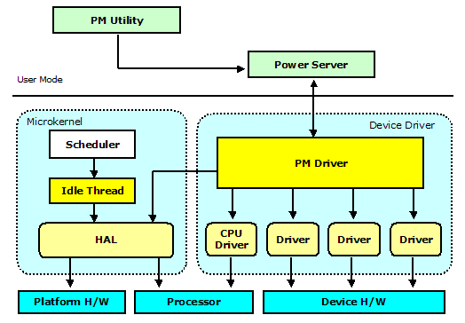
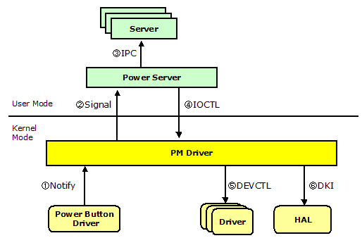
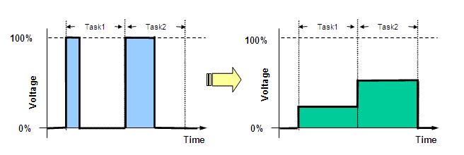

# Prex Power Management

### Table of Contents

- Introduction
- Architecture Overview
- System Power Management
- Power Server
- PM Driver Interface
- Idle Thread
- System Shutdown
- Processor Power Management
- Power Management Utilities
- References

## Introduction

Prex is designed to be used with battery-powered devices, such as mobile phones or consumer electronics devices. So, Prex provides an integrated and system-wide set of power management features. It helps to extend battery life, save energy and reduce heat and noise.

This document describes the design and implementation of the power management features of Prex.

## Architecture Overview

The following components work together for power management in Prex.

- **PM Utility:** handles the user's power management request.
- **Power Server:** maintains the power policy and maps each power event to the power action.
- **PM Driver:** controls the power state and power management timers.
- **HAL:** controls the platform/architecture dependent hardware.
- **Idle Thread:** works to cut needless power when the system is in idle.
- **CPU Driver:** has responsible to control frequency/voltage of the processor.
- **Device Drivers:** has responsible to adjust power of each device.

  
 Figure 1. Power Management Overview

## System Power Management

### Power States

Prex supports the following power states.

- **Power On**
- **Suspend** 
- **Power Off**

In the suspend state, the system powers down devices that are not needed in order to safe electricity, e.g. it may switch the monitor, sound card or modem off and turn them back on when the system returns from the suspend state.

### Power Management Timer

Prex provides the power management timer which sets the system to the suspend state after a period of inactivity. If a device driver detects some user activities (e.g. keyboard input), the driver should notify it to the PM driver by using pm_notify() function to reload the PM timer.

LCD off timer is also provided by PM driver, and LCD driver can support automatic LCD off if it has the h/w capability.

### Power Policy

The Power Server maintains a system-wide policy setting for its power operations. A user application can change the power policy appropriately for the user environment. Prex supports the following two power policies.

| PM Policy      | Frequency/Voltage Control | Suspend Timer | LCD Off Timer | Device Performance |
| -------------- | ------------------------- | ------------- | ------------- | ------------------ |
| PM_POWERSAVE   | Adaptive                  | Active        | Active        | Full               |
| PM_PERFORMANCE | Max Level                 | Frozen        | Frozen        | Adaptive           |

## Power Server

Power Server maintains the power policy that maps each power event to the power action.

The power server always monitors the power events sent from PM driver. The default power actions are listed in the following table.

| Power Event      | Power Action |
| ---------------- | ------------ |
| PME_PWRBTN_PRESS | PWR_OFF      |
| PME_LOW_BATTERY  | PWR_SUSPEND  |
| PME_SLPBTN_PRESS | PWR_SUSPEND  |
| PME_LCD_CLOSE    | PWR_OFF      |

## PM Driver Interface


### PM I/O Control

IOCTL functions manipulate the power state and power policy used by the PM driver. It also handles the request for the suspend timer.

| Code              | Parameter    | Description                  |
| ----------------- | ------------ | ---------------------------- |
| PMIOC_CONNECT     | Task ID      | Connection from power server |
| PMIOC_QUERY_EVENT | Event        | Query power event            |
| PMIOC_SET_POWER   | Power state  | Set system power state       |
| PMIOC_SET_POLICY  | Power policy | Set power policy             |
| PMIOC_GET_POLICY  | Power policy | Get power policy             |
| PMIOC_SET_SUSTMR  | Timeout time | Set suspend timer            |
| PMIOC_GET_SUSTMR  | Timeout time | Get suspend timer            |
| PMIOC_SET_DIMTMR  | Timeout time | Set dim timer                |
| PMIOC_GET_DIMTMR  | Timeout time | Get dim timer                |

### PM Device Control

Each device driver can receive the power management event sent by the PM driver.

| Code                | Parameter    | Description              |
| ------------------- | ------------ | ------------------------ |
| DEVCTL_PM_POWERDOWN | -            | Set to low power mode    |
| DEVCTL_PM_POWERUP   | -            | Set to normal power mode |
| DEVCTL_PM_CHGPOLICY | Power policy | Change power policy      |
| DEVCTL_PM_LCDOFF    | -            | Power off LCD            |
| DEVCTL_PM_LCDON     | -            | Power on LCD             |


The device drivers should monitor PM events by using devctl() methods. And, when the driver receives DEVCTL_PM_POWERDOWN, it should program the device to different power mode to conserve total system power.

```
int
XXX_devctl(device_t dev, u_long cmd, void *arg)
{

        switch (cmd) {
        case DEVCTL_PM_POWERDOWN:
                /* Program device to low power state. */
                break;
        case DEVCTL_PM_POWERUP:
                /* Program device to normal power state. */
                break;
        }
        return 0;
}
```

### PM Driver Service

Each device driver can use the following PM services.

```
void    pm_notify(int event);
int     pm_set_power(int);
void    pm_attach_lcd(device_t dev);
```

- pm_notify()

  Notify the power event.

- pm_set_power()

  Set the system power state.

- pm_attach_lcd()

  Attach a device as LCD device. PM driver will call devctl routine of the attached device with DEVCTL_PM_LCDOFF or DEVCTL_PM_LCDON.

## Idle Thread

The idle thread works as a kernel thread, and it is assigned the lowest scheduling priority in the system. Thus, the idle thread runs when no other thread is active. It has the role of cutting down the power consumption of the system.

An idle thread is just a forever-loop to call the machine dependent routine to cut power. The following thread_idle() routine is called at the end of the kernel initialization.

```
void
thread_idle(void)
{

        for (;;) {
                machine_idle();
                sched_yield();
        }
}
```

The machine_idle() routine will program the platform H/W to the low power mode. This is typically invoking the power saving (halt) instruction supported by the processor. If any interrupts are occurred in this low power mode, it must be returned immediately from machine_idle(). Then, the idle thread will call sched_yield() to check the re-scheduling.

## System Shutdown

When the PM driver receives a reset request from users or drivers, it will call machine_reset() service in the microkernel. Or, the microkernel may reset the system by itself if it finds an unrecoverable error.

The following figure illustrates the control flow of shutdown by power button press.

  
 Figure 2. Shutdown Flow

1.  If power button driver detects the user's power button press, it will notify the event to pm driver by pm_notify().
2. PM driver sends a power signal (SIGPWR) to the power server.
3. Power server translates the power button event to the system power down. It will send IPC message (STD_SHUTDOWN) to other system servers. So, the system servers can do some jobs for the shutdown.
4. Power server requests the power down to the PM driver by using I/O control message (PMIOC_SET_POWER).
5. PM driver will broadcast a power down control message (DEVCTL_PM_POWERDOWN) for all device drivers. A device driver can prepare for the shutdown by monitoring this driver message.
6. PM driver calls HAL interface (machine_shutdown()) to set the system off.

## Processor Power Management

### Dynamic Voltage Scaling

Dynamic voltage scaling (DVS) is widely used with mobile systems to save the processor power consumption, with minimum impact on performance. The basic idea is come from the fact the power consumption is proportional to V^2 x f, where V is voltage and f is frequency. Since processor does not always require the full performance, we can reduce power consumption by lowering voltage and frequency.

The following figure shows how the system executes tasks with lower power consumption.

  
 Figure 3. DVS Control

### Algorithm

#### Adjusting CPU Speed

We use the DVS algorithm known as Weiser Style [1]. If the utilization prediction x is high (over 70%), increase the speed by 20% of the maximum speed. If the utilization prediction is low (under 50%), decrease the speed by (60 - x)% of the maximum speed.

DVS Algorithm: **Weiser Style**

```
run_cycles += excess_cycles;
run_percent = (run_cycles * 100) / (idle_cycles + run_cycles);

next_excess = run_cycles - speed * (run_cycles + idle_cycles) / 100;
if (next_excess < 0)
        next_excess = 0;

if (excess_cycles > idle_cycles)
        newspeed = 100;
else if (run_percent > 70)
        newspeed = speed + 20;
else if (run_percent < 50)
        newspeed = speed - (60 - run_percent);

if (newspeed > max_speed)
        newspeed = max_speed;
if (newspeed < min_speed)
        newspeed = min_speed;

excess_cycles = next_excess;
```

excess_cycles is defined as the number of uncompleted run cycles from the last interval. For example, if we find 70% activity when running at full speed, and their processor speed was set to 50% during that interval, excess_cycles is set to 20%. This value (20%) is used to calculate the processor speed in the next interval.

#### Max CPU Speed

The PM driver adjusts max CPU speed by using DVS algorithm called AVG<3> [2]. It computes an exponentially moving average of the previous intervals. "weight" is the relative weighting of past intervals relative to the current interval.

DVS Algorithm: **AVG<3>**

```
predict = (weight x current + past) / (weight + 1)
```

### Processor Driver Interface

#### CPU I/O Control

IOCTL functions for CPU frequency control are as follows:

| Code           | Parameter          | Description                   |
| -------------- | ------------------ | ----------------------------- |
| CFIOC_GET_INFO | struct cpufreqinfo | Get CPU frequency information |

CPU requency information structure:

```
struct cpufreqinfo {
        int     maxfreq;        /* max speed in MHz */
        int     maxvolts;       /* max power in mV */
        int     freq;           /* current speed in MHz */
        int     volts;          /* current power in mV */
};
```

#### Performance Control Services

If the target processor supports performance control, the CPU driver can export the following operations to utilize it.

```
struct cpufreq_ops {
	int	(*setperf)(int speed);
	int	(*getperf)(void);
	void	(*getinfo)(struct cpufreqinfo *info);
};
```

- cpu_setperf()

  Set the processor performance level. The argument is percent of CPU speed (0-100).

- cpu_getperf()

  Get the current performance level.

- cpu_getinfo()

  Get the processor information.

## Power Management Utilities

### pmctrl - PM Control Utility

pmctrl is an utility to manage the various power management state in the system.

```
[prex:/boot]# pmctrl -?
usage: pmctrl command
commands:
 off      -- Power off.
 reboot   -- Reboot system.
 suspend  -- Suspend system.
 info     -- Disaplay power management information.
 policy   -- Set power policy.
 sustime  -- Set timeout for suspend timer.
 dimtime  -- Set timeout for dim timer.
 battery  -- Show current battery level.
 -?       -- This help.
[prex:/boot]#
```

pmctrl will translate the user request to the IPC message to the power server. pmctrl utility must have CAP_POWERMGMT capability in security setting.

### cpumon - CPU Monitor

The CPU monitor is a sample application to show the current processor power state - speed and its power.

```
CPU voltage monitor
Speed:  600MHz  0|********------------|100
Power:  956mV   0|*************-------|100
```

The source code of this application can be found in the directory named "/usr/sample/cpumon".


## References

- [1] M.Weiser, B.Welch, A.Demers, and S.Shenker, "Scheduling for Reduced CPU Energy", In Proceedings of the 1st Symposium on Operating Systems Design and Implementation, pages 13-23, November 1994.
- [2] K.Govil, E.Chan, H.Wasserman, "Comparing Algorithm for Dynamic Speed-Setting of a Low-Power CPU". Proc. 1st Int'l Conference on Mobile Computing and Networking, Nov 1995.


Copyright© 2005-2009 Kohsuke Ohtani
