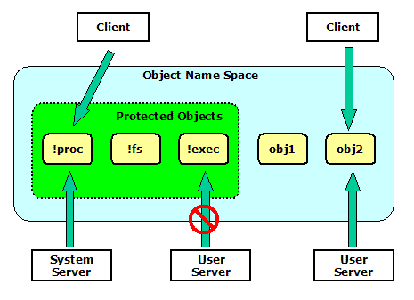

# Prex Platform Security

## Introduction

As a recent tendency, security is becoming very important in embedded systems design. So, we identify security as a key goal and design component for Prex.

Prex supports installation and execution of the user applications by the end user. This design has higher security risk compared with other RTOS that can execute only pre-defined applications. So, Prex provides system-wide security features to protect the system from the threat.

This document describes the design and implementation of the platform security of Prex.

## Security Model

### Prerequisite

To achieve the effective security described in this document, it requires MMU support in the system. It's because we have to use separate memory space for the kernel and each user mode application.

### Unit of Trust

Unlike generic desktop OS used on PC, Prex is designed for a single user (We can not assume that the user "login" to the Phone or MP3 player at every power-on). So, the task is unit of trust with Prex. The system designer can manage the security permission of each task.

### Key Features

The key security features of Prex are as follows:

- Task Capabilities
- File Access Control
- Secure Servers
- Protected Device
- Resource Limits

## Task Capabilities

Prex supports a security framework named "capability" which was derived from POSIX.1e capabilities. Each task will have its own capabilities for various operations. When a task tries to do a privileged operation, the kernel, device drivers and system servers will check the appropriate bit in the task's capability.

### Types of Capability

The type of capability is unsigned 32-bit integer. So, we can define 32 types of capabilities in the maximum.

```
typedef uint32_t	cap_t;
```

The system defines the following capabilities:

| Capability    | Operations Permits                                           |
| ------------- | ------------------------------------------------------------ |
| CAP_NICE      | Change scheduling parameters of another task.  Set the priority to real-time priority or above. |
| CAP_RAWIO     | Perform raw I/O operations. (Use device_* API)               |
| CAP_KILL      | Raise exceptions to another task.                            |
| CAP_SETPCAP   | Set capability.                                              |
| CAP_TASKCTRL  | Control another task's execution. (Create, terminate or suspend task/thread) |
| CAP_EXTMEM    | Access another task's memory. (Allocate, free or map memory region in another task) |
| CAP_PROTSERV  | Create an object with a protected name started with '!'.      Send a privileged IPC message to other system servers. |
| CAP_NETWORK   | Perform various network-related operations.                  |
| CAP_POWERMGMT | Perform power management operations. (Shutdown system, set idle timer,      change power policy etc) |
| CAP_DISKADMIN | Use disk administration functions like mount, umount, etc.   |
| CAP_USERFILES | Access to confidential user files.                           |
| CAP_SYSFILES  | Access to system files.                                      |

### Capability Assignment

The task's capabilities are set in the following two conditions:

1. Boot: The default capability sets are assigned to boot tasks by the kernel at system boot.
2. Runtime: Appropriate capabilities are set by the exec server from the pre-defined security policy.

The kernel provides the following APIs to control task's capability.

```
int task_setcap(task_t task, cap_t cap);
int task_chkcap(task_t task, cap_t cap);
```

task_setcap() function can be used only by the task which has CAP_SETPCAP capability. So, CAP_SETPCAP capability is set to the exec server by the kernel at boot.

### Kernel API

The kernel checks whether the task has an appropriate capability to call the specific kernel API. If the caller task does not have the proper capability, the kernel will reject the request with EPERM error.

task_capable() in task.c is used to check whether the current task has the specific capability.

```
int
task_capable(cap_t cap)
{
        int capable = 1;

        if ((curtask->capability & cap) == 0) {
                DPRINTF(("Denying capability by kernel: task=%s cap=%08x\n",
                         curtask->name, cap));
                if (curtask->flags & TF_AUDIT)
                        panic("audit failed");
                capable = 0;
        }
        return capable;
}
```

vm_map() kernel API requires CAP_EXTMEM because a malicious task can access to other task's memory space by using this API.

```
int
vm_map(task_t target, void *addr, size_t size, void **alloc)
{
        int error;

        sched_lock();
        if (!task_valid(target)) {
                sched_unlock();
                return ESRCH;
        }
        if (target == curtask) {
                sched_unlock();
                return EINVAL;
        }
        if (!task_capable(CAP_EXTMEM)) {
                sched_unlock();
                return EPERM;
        }

        ...
}
```

### Security Auditing

To enable security auditing, the following option should be enabled in the configuration file.

```
options 	AUDIT		# Security auditing
```

When the audit option is enabled, the kernel marks the audit flag for all tasks. In this condition, the kernel will log the event for all capability violation. This is useful for platform builders to adjust the security policy.

## File Access Control

### Pre-defined Directories

Prex supports the file access permission based on the path name. It means that the applications have access to only certain area of the file system.

The file system has the following structure:

- /boot

  This directory contains the server executable files and the system files like a splash screen image. Reading this directory is allowed only to the server process which has CAP_SYSFILES capability. Nobody can write to this directory at any time.

- /private

  This is the restricted system area and is inaccessible to the normal processes. It contains private user data like passwords or security settings. CAP_ALLFILES capability is required to access to the /private contents.

- /bin

  This directory contains the trusted applications.  This is read-only directory for normal processes, and CAP_ALLFILES is required to write files to it. In typical case, a software installer has right to copy the executable files to this directory.

- /etc

  This directory contains the various configuration files. This is read-only for normal processes, and CAP_CFGFILES is required to modify /etc. The system configurator will modify the contents in /etc, or all application can modify it only when the system boots with recovery mode.

- /all the rest

  Access to all the other directories is unrestricted.

| Directory | Read         | Write        | Execute     |
| --------- | ------------ | ------------ | ----------- |
| /boot     | CAP_SYSFILES | Not Allowed  | Any         |
| /private  | CAP_ALLFILES | CAP_ALLFILES | Not Allowed |
| /bin      | Any          | CAP_SYSFILES | Any         |
| /etc      | Any          | CAP_SYSFILES | Not Allowed |
| /other    | Any          | Any          | Not Allowed |

### File Access Example

The following is a sample to test copying a file to /etc directory without CAP_SYSFILES capability.

```
[prex:/etc]# ls
rc        fstab
[prex:/etc]# cat rc
PATH=/boot:/bin
HOME=/
export HOME PATH
uname -msr
mem
date
exec sh
[prex:/etc]# cp rc rc.2
Denying capability by fs: task=cp cap=00000800
Kernel panic: audit failed
```

\* The audit option is enabled for kernel with this example.

## I/O Access Control

### Raw I/O Access

The raw I/O access is allowed only to the task which has CAP_RAWIO capability. This means that device_open() kernel call will be failed with EPERM error for the unauthorized process.

The CAP_RAWIO capability is usually assigned to all real-time tasks, and it is not set to the Unix process. So, the Unix process must access the device via the device file under /dev. The POSIX open() call will transfer the I/O request to the file system server , and then, the file system server will invoke device I/O kernel call.

### Protected Device

The device driver can set the protected flag (D_PROT) for the device object. If the device object is marked as protected, the file system server will reject the I/O request to such devices. It means that the application can not access the protected devices via Unix I/O calls. If the application has CAP_RAWIO capability, it still can access the protected device directly via kernel API.

For example, a ram disk driver should be protected for normal tasks because only a file server can use it. So, the ram disk driver will create the device object with D_PROT flag as follows.

```
static int
ramdisk_init(struct driver *self)
{
        device_t dev;

        dev = device_create(self, "ram0", D_BLK|D_PROT);

        ...
}
```

With this example, the device object for the ram disk can not be opened with open() system call.

The protected flag will be marked as 'P' with 'device' command in the kernel debugger.

```
[kd] device
Device list:
 device   name         flags
 -------- ------------ -----
 8000e1f4 fd0          -B-P-
 8000e194 ram0         -B-P-
 8000e154 zero         C----
 8000e114 null         C----
 8000e0a4 rtc          C----
 8000e014 cpufreq      C--P-
 8000df94 vga          C----
 8000dee4 kbd          C----
 8000dc34 tty          C---T
 8000dbf4 console      C---T
 8000db44 pm           C--P-

[kd]
```

## Security Policy

### Default Capability Set

The system has static capability set which is assigned for the boot tasks by kernel at system boot. The default capability set is defined in the file /include/sys/capability.h.

```
#define CAPSET_BOOT	0x00000043	/* capabilities for boot tasks */
```

Note: This definition should be customized in the configuration file.

### Capability Binding

When the exec server executes the user application, it will assign the capabilities defined in the capability table. The capability table is defined in the configuration file (/conf/etc/security), and the actual table is built at the OS compile time. So, we have to re-compile the system to change the security policy.

```
#
# Security configuration
#

capability      /boot/boot      CAP_DISKADMIN \
                                CAP_PROTSERV \
                                CAP_SYSFILES

capability      /boot/proc      CAP_RAWIO \
                                CAP_KILL \
                                CAP_TASKCTRL \
                                CAP_EXTMEM \
                                CAP_PROTSERV

capability      /boot/fs        CAP_NICE \
                                CAP_RAWIO \
                                CAP_EXTMEM \
                                CAP_SYSFILES \
                                CAP_PROTSERV

capability      /boot/exec      CAP_NICE \
                                CAP_SETPCAP \
                                CAP_TASKCTRL \
                                CAP_EXTMEM \
                                CAP_PROTSERV \
                                CAP_SYSFILES

capability      /boot/pow       CAP_RAWIO \
                                CAP_KILL \
                                CAP_POWERMGMT \
                                CAP_PROTSERV

capability      /boot/init      CAP_KILL

capability      /boot/cmdbox    CAP_NICE \
                                CAP_KILL

capability      /boot/install   CAP_SYSFILES

capability      /boot/pmctrl    CAP_POWERMGMT

capability      /boot/lock      CAP_USERFILES
```

** Note: Do not set CAP_SETPCAP capability except the exec server in the security policy.*

## Secure Servers

### Protected Object

The object name started with '!' means that it is a protected object. The protected object can be created only by the task which has CAP_PROTSERV capability. Since this capability is given to the known system servers, the client task can always trust the object owner.

  
 Figure 1. Protected Objects

### Checking Client's Capability

The server task will have some capabilities to execute various privileged operations requested by client tasks. Therefore, the server should refuse the request of the client when the client does not have the right to the operation.

The system server must call the task_chkcap() to check the client task's right to send the specific IPC message. For this purpose, the kernel stores the client's task ID in each IPC message header. Thus, the server can always get the correct task ID of the client task.

```
struct msg_header {
        task_t  task;           /* id of send task */
        int     code;           /* message code */
        int     status;         /* return status */
};
```

For example, the power sever always checks whether the client task has CAP_POWERMGMT capability. This is because the power management operation such like shutdown is privileged operation and should be limited only to the power management utility (pmctrl).

Figure 2 shows the capability check for shutdown operation.

  
 Figure 2. Capability Check for Shutdown

The following is a sample code to check the capability of the client task.

```
/*
 * Main routine for power server.
 */
int
main(int argc, char *argv[])
{
        (snip)

        /*
         * Message loop
         */
        for (;;) {
                /* Wait for an incoming request. */
                error = msg_receive(obj, &msg, sizeof(msg));
                if (error)
                        continue;

                /* Check client's capability. */
                if (task_chkcap(msg.hdr.task, CAP_POWERMGMT) != 0) {
                        map = NULL;
                        error = EPERM;
                }
        ...
}
```

## Other Security Features

### Resource Limits

The kernel and system servers will limit the maximum count of the resource to create. This will prevent the DoS (Denial of Service) attack by malicious applications.

### Software Installer

The software installer has CAP_SYSFILES capability to copy the applications into the /bin and /etc directories. It always requests user confirmation before installing software.

```
[prex:/tmp]# install test
Are you sure you want to install test? (y/n) y
[prex:/tmp]#
```


Copyright© 2005-2009 Kohsuke Ohtani
