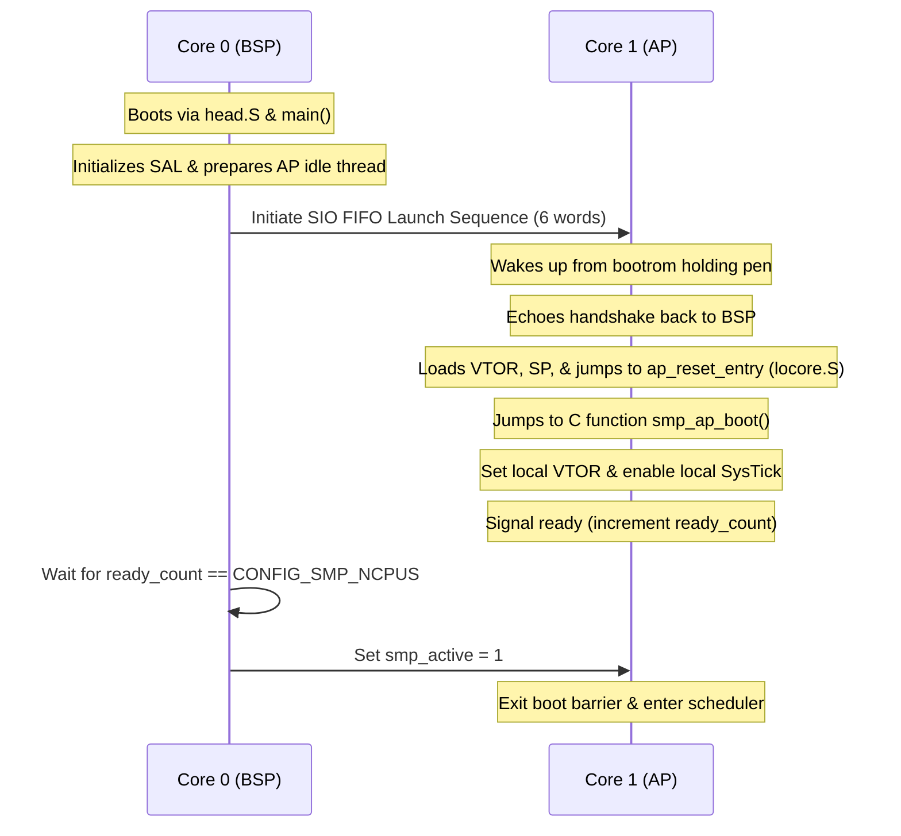

# Prex+ ARMv8-M SMP Implementation Plan (Raspberry Pi Pico 2 / RP2350)

This document outlines the detailed design and implementation plan for Symmetric Multiprocessing (SMP) support on the ARMv8-M Mainline architecture, specifically targeting the dual-core Cortex-M33 Raspberry Pi Pico 2 (RP2350) platform in Prex+.

---

## 1. Architectural Context & Design Philosophy

Prex+ SMP extends the uniprocessor (UP) microkernel using the **Big Kernel Lock (BKL)** design. The kernel execution is serialized using a recursive global lock (`kernel_lock`) while allowing concurrent execution of user tasks on multiple cores.

The Raspberry Pi Pico 2 (RP2350) platform features:
1. **Dual Cortex-M33 Cores:** Core 0 (Bootstrap Processor - BSP) and Core 1 (Application Processor - AP).
2. **TrustZone-M:** Kernel executes in Secure Handler/Thread modes, and user tasks run in Non-Secure Thread mode.
3. **No-MMU layout with Execute-in-Place (XIP):** Code resides in read-only QSPI Flash; `.data`, `.bss`, and GOT tables are relocated to SRAM.
4. **Per-Core NVIC & SysTick:** The Nested Vectored Interrupt Controller (NVIC) and the SysTick timer are private/local to each processor core.

---

## 2. Core Identity & Per-CPU Management

To support multi-core execution, core-local state is moved into a per-CPU `struct cpu_control` (defined in `sys/include/cpu_control.h`).

### 2.1 Storage of CPU Control Block Pointer
Zero-latency access to the current CPU's control block is achieved using hardware-backed registers. 
- In the ARMv8-M implementation, the Secure **`psplim`** (Process Stack Pointer Limit) register is repurposed to hold the address of the core's local `struct cpu_control`.
- The HAL functions `hal_get_cpu_control()` and `hal_set_cpu_control()` are already defined in `bsp/hal/arm/include/cpu.h` as:
  ```c
  static inline struct cpu_control* hal_get_cpu_control(void) {
      uint32_t cpu;
      __asm__ volatile("mrs %0, psplim" : "=r"(cpu));
      return (struct cpu_control*)cpu;
  }
  static inline void hal_set_cpu_control(struct cpu_control* cpu) {
      __asm__ volatile("msr psplim, %0" : : "r"(cpu));
  }
  ```

### 2.2 Querying CPU ID at Runtime
Cortex-M33 does not have a standard, architecturally-defined CPU Core ID register in the CPU register space. 
On the RP2350, core identification is done via the **SIO (Single-cycle IO)** register block:
- **Base Address:** `0xd0000000` (Secure/Non-secure mapped).
- **CPUID Register (Offset `0x000`):** Reading this address returns the CPU ID:
  - Core 0: returns `0`
  - Core 1: returns `1`
- The `hal_cpu_id()` helper in `bsp/hal/arm/arch/armv8-m/cpufunc.c` will be updated to:
  ```c
  uint32_t hal_cpu_id(void) {
  #ifdef CONFIG_SMP
      return *(volatile uint32_t*)0xd0000000;
  #else
      return 0;
  #endif
  }
  ```

---

## 3. Multicore Boot Sequence (BSP and APs)

The boot sequence consists of three phases:



### 3.1 Step 1: Bootstrap Processor (BSP) Early Boot
1. CPU0 executes `reset_entry` in `bsp/hal/arm/arch/armv8-m/locore.S`. It reads `0xd0000000` to confirm it is Core 0, clears the BSS, and jumps to `main()`.
2. BSP initializes the system, registers `cpu_table[0]`, and calls `smp_start_aps()` to wake up Core 1.

### 3.2 Step 2: Waking up the Application Processor (AP)
The BSP launches CPU1 using the **SIO FIFO handshake protocol**. 
The SIO FIFO registers are located at `SIO_BASE` (`0xd0000000`):
- `FIFO_ST` (Offset `0x050`): Status register (bit 0 = `VLD` (RX data valid), bit 2 = `RDY` (TX ready)).
- `FIFO_WR` (Offset `0x054`): Write data to peer core.
- `FIFO_RD` (Offset `0x058`): Read data from peer core.

To launch Core 1:
1. **Clear FIFO:** Drain any remaining data in `FIFO_RD` until `VLD` is 0.
2. **Execute Handshake:** Core 0 pushes a sequence of 6 words, waiting for Core 1 to echo each back:
   - Word 1: `0` (Launch command).
   - Word 2: `0` (Handshake).
   - Word 3: `1` (Handshake).
   - Word 4: `vector_table` base address (`kernel_start`).
   - Word 5: `sp` (`&ap_boot_stacks[1][KSTACKSZ]`).
   - Word 6: `entry` (`&ap_reset_entry`).
3. Core 1 wakes from the bootrom holding pen and starts executing at `ap_reset_entry`.

- Implement this in `bsp/hal/arm/arch/armv8-m/cpufunc.c`:
  ```c
  static void fifo_push(uint32_t val) {
      volatile uint32_t *fifo_st = (volatile uint32_t *)0xd0000050;
      volatile uint32_t *fifo_wr = (volatile uint32_t *)0xd0000054;
      while (!(*fifo_st & (1 << 2))) ; /* Wait for TX ready */
      *fifo_wr = val;
      __asm__ volatile("sev");
  }

  static uint32_t fifo_pop(void) {
      volatile uint32_t *fifo_st = (volatile uint32_t *)0xd0000050;
      volatile uint32_t *fifo_rd = (volatile uint32_t *)0xd0000058;
      while (!(*fifo_st & (1 << 0))) { /* Wait for RX valid */
          __asm__ volatile("wfe");
      }
      return *fifo_rd;
  }

  int hal_cpu_start(uint32_t cpuid, paddr_t entry) {
      if (cpuid == 1) {
          /* Drain FIFO */
          volatile uint32_t *fifo_st = (volatile uint32_t *)0xd0000050;
          volatile uint32_t *fifo_rd = (volatile uint32_t *)0xd0000058;
          while (*fifo_st & (1 << 0)) {
              (void)*fifo_rd;
          }

          /* 6-word handshake protocol */
          uint32_t cmd[] = {
              0, 
              0, 
              1, 
              (uint32_t)&kernel_start, 
              (uint32_t)&ap_boot_stacks[1][KSTACKSZ], 
              (uint32_t)entry
          };

          for (int i = 0; i < 6; i++) {
              fifo_push(cmd[i]);
              if (fifo_pop() != cmd[i]) {
                  return -1; /* Handshake mismatch */
              }
          }
          return 0;
      }
      return -1;
  }
  ```

### 3.3 Step 3: AP Assembly Entry (`locore.S`)
Update `reset_entry` in `bsp/hal/arm/arch/armv8-m/locore.S` to branch secondary cores to `ap_reset_entry`:
```assembly
ENTRY(reset_entry)
    cpsid   i
    
    /* Check CPU ID via SIO register */
    ldr     r0, =0xd0000000
    ldr     r0, [r0]
    cmp     r0, #0
    bne     ap_reset_entry
    
    /* BSP continues (setting stack, clearing BSS, jumping to main) */
    ...
```
Implement `ap_reset_entry` in `locore.S` to configure the AP-specific stack:
```assembly
ENTRY(ap_reset_entry)
    /* Read CPU ID from SIO */
    ldr     r0, =0xd0000000
    ldr     r0, [r0]
    
    /* sp = &ap_boot_stacks[cpuid][KSTACKSZ] */
    ldr     r1, =ap_boot_stacks
    ldr     r2, =KSTACKSZ
    add     r3, r0, #1
    mul     r4, r3, r2
    add     sp, r1, r4
    
    /* Enforce 8-byte stack alignment (CCR) */
    ldr     r0, =0xE000ED14
    ldr     r1, [r0]
    orr     r1, r1, #8
    str     r1, [r0]
    
    /* Jump to smp_ap_boot() */
    ldr     r0, =smp_ap_boot
    bx      r0
```

---

## 4. Cross-Core Signaling (IPI) & Rescheduling

### 4.1 SIO Doorbell for Hardware IPI
On the RP2350, inter-processor interrupts are triggered using the **SIO Doorbell** registers:
- `DOORBELL0` (Offset `0x060`): Core 0 writes here to trigger an interrupt on Core 1.
- `DOORBELL1` (Offset `0x064`): Core 1 writes here to trigger an interrupt on Core 0.
- **IPI Interrupt Vector:** The SIO interrupts map to `SIO_IRQ_FIFO` (IRQ 15 / 16 on the cores). We define `IPI_IRQ` as `15` in `bsp/hal/arm/include/cpu.h`.

When sending an IPI, `hal_cpu_send_ipi()` writes to the respective Doorbell register.

### 4.2 Handling and Clearing the Doorbell Interrupt
When the SIO interrupt fires, the target CPU enters `interrupt_handler()` in `bsp/hal/arm/arch/armv8-m/interrupt.c`. The interrupt must be cleared in the handler by writing to the doorbell clear register (offset `0x068` for Core 0 clear, `0x06c` for Core 1 clear):
```c
if (vector == 15) {
    uint32_t cpuid = hal_cpu_id();
    if (cpuid == 0) {
        volatile uint32_t *db_clr = (volatile uint32_t *)0xd0000068;
        *db_clr = 0xffffffff; /* Clear Core 0 doorbell interrupt */
    } else {
        volatile uint32_t *db_clr = (volatile uint32_t *)0xd000006c;
        *db_clr = 0xffffffff; /* Clear Core 1 doorbell interrupt */
    }
}
```

### 4.3 QEMU Emulation Fallback (Timer-Based Polling)
In QEMU, depending on the model version used for the RP2350/Pico 2, the Doorbell registers might not trigger the target NVIC interrupt.

To ensure scheduler correctness in the QEMU simulator, we implement a **software-polling check** inside the SysTick timer handler:
1. Define a global array of pending IPIs:
   ```c
   volatile int ipi_pending[CONFIG_SMP_NCPUS];
   ```
2. When sending an IPI via `hal_cpu_send_ipi()`, set `ipi_pending[target_cpu] = 1`.
3. In `interrupt_handler()` for the SysTick Timer (vector `-1`):
   ```c
   if (vector == -1) { /* SysTick Timer */
       ...
       /* QEMU Fallback Check */
       uint32_t cpuid = hal_cpu_id();
       if (ipi_pending[cpuid]) {
           ipi_pending[cpuid] = 0;
           irq_handler(IPI_IRQ); /* Dispatch IPI manually */
       }
       timer_handler();
       ...
   }
   ```
This allows rescheduling to be deferred to the next SysTick tick (at most 10ms latency) in QEMU, while preserving hardware-accurate SIO doorbell code path execution.

---

## 5. Local Interrupt and Timer Configuration

Since the NVIC and SysTick are core-local, they must be initialized on the secondary core (AP) during `smp_ap_boot()`.

1. **`interrupt_cpu_init()`** in `bsp/hal/arm/arch/armv8-m/interrupt.c`:
   - Set the AP's Vector Table Offset Register (VTOR) at `0xE000ED08` to `kernel_start`.
   - Set basepri to `0` (allow all interrupts).
   - Unmask/enable SysTick and the SIO Doorbell/FIFO interrupt (IRQ 15) in the AP's NVIC.
2. **`clock_ap_init()`** in `bsp/hal/arm/arch/armv8-m/clock.c`:
   - Configures the local SysTick timer registers (`SYST_CSR`, `SYST_RVR`, `SYST_CVR`) and starts the timer.

---

## 6. Implementation Roadmap

### Phase 1: Configuration & Identity Setup
- Create `conf/arm/pico2.base` with `options SMP_NCPUS=2`.
- Update `hal_cpu_id()` in `bsp/hal/arm/arch/armv8-m/cpufunc.c` to read the SIO `CPUID` register.
- Define `IPI_IRQ` as 15 in `bsp/hal/arm/include/cpu.h`.

### Phase 2: Multicore Boot & Assembly Setup
- Update `bsp/hal/arm/arch/armv8-m/locore.S` to check the CPU ID via SIO in `reset_entry` and branch CPU1 to `ap_reset_entry`.
- Implement `ap_reset_entry` to calculate the stack offset using `ap_boot_stacks` and jump to `smp_ap_boot()`.
- Implement `hal_cpu_start()` in `bsp/hal/arm/arch/armv8-m/cpufunc.c` to perform the SIO FIFO 6-word handshake protocol.

### Phase 3: Interrupt & Timer Initialization
- Implement `interrupt_cpu_init()` in `bsp/hal/arm/arch/armv8-m/interrupt.c` to load VTOR and configure local NVIC registers.
- Ensure `clock_ap_init()` is compiled and runs SysTick for CPU1.

### Phase 4: IPI Integration & Simulation Verification
- Implement `hal_cpu_send_ipi()` in `bsp/hal/arm/arch/armv8-m/cpufunc.c` (or a new `smp.c` in `bsp/hal/arm/arch/armv8-m/`) writing to the SIO Doorbell registers.
- Update `interrupt_handler()` in `interrupt.c` to check for and clear SIO Doorbell interrupts, and implement the `ipi_pending` QEMU timer-polling fallback.
- Run `verify_all.sh` to compile and boot Prex+ with SMP enabled on the `pico2` target.
